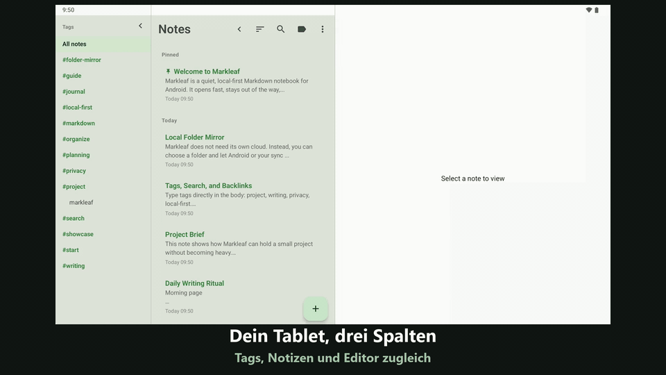

#  Markleaf

<p align="center">
  
</p>

<p align="center">
  <strong>Gedanken, die sich leicht ansammeln – aufgeräumte Markdown-Notizen</strong><br />
  Eine local-first, minimalistische Markdown-Notiz-App für Android
</p>

<p align="center">
  <a href="https://trendshift.io/repositories/58116?utm_source=trendshift-badge&utm_medium=badge&utm_campaign=badge-trendshift-58116"></a>
</p>

<p align="center">
  
  
  
  
  
  
</p>

<p align="center">
  <a href="README.md">English</a> ·
  <a href="README.ko.md">한국어</a> ·
  <a href="README.ja.md">日本語</a> ·
  <a href="README.zh.md">简体中文</a> ·
  <strong>Deutsch</strong> ·
  <a href="README.es.md">Español</a> ·
  <a href="README.fr.md">Français</a> ·
  <a href="README.hr.md">Hrvatski</a>
</p>

<p align="center">
  <a href="https://github.com/jeiel85/markleaf-android">GitHub-Repository</a> ·
  <a href="https://github.com/jeiel85/markleaf-android/discussions">Discussions (Feedback)</a> ·
  <a href="https://gitlab.com/jeiel85/markleaf-android">GitLab-Mirror (archiviert)</a>
</p>

<p align="center">
  
</p>

<p align="center">
  <sub><code>/</code> Schnelleinfügen → reines Markdown → Live-Vorschau</sub>
</p>

<p align="center">
  
</p>

<p align="center">
  <sub>Tablet mit 3 Spalten — Tag-Leiste · Notizliste · Editor auf einem Bildschirm</sub>
</p>

---

## 🍃 Was ist Markleaf?

**Markleaf** ist eine Android-Markdown-Notiz-App, die bewusst auf Ballast verzichtet, damit du dich auf zwei Dinge konzentrieren kannst: festhalten und ordnen. Deine Daten liegen ausschließlich auf deinem Gerät, und das standardisierte Markdown-Format garantiert volle Eigentümerschaft und Portabilität. Auch die Synchronisierung läuft nur über *einen von dir gewählten Ordner* – Markleaf selbst geht nie online.

[**Branding-Seite ansehen**](https://jeiel85.github.io/markleaf-android/) · [Aktuelle Version: v2.36.1](https://github.com/jeiel85/markleaf-android/releases/tag/v2.36.1) · [Datenschutzerklärung](https://jeiel85.github.io/markleaf-android/privacy.html) · [F-Droid](https://f-droid.org/packages/com.markleaf.notes/) · [Google Play](https://play.google.com/store/apps/details?id=com.markleaf.notes)

---

## ✨ Hauptfunktionen

### Schreiben & Vorschau
- **`/` Schnelleinfügen** – Befehle am Zeilenanfang suchen und Überschriften, Listen, Tabellen, Callouts, Wikilinks, Bilder und mehr als Standard-Markdown einfügen
- **Live-Markdown-Vorschau** – sofortiger Wechsel zwischen Bearbeitung und Vorschau, oder Live-Syntaxfärbung über die Option *Show Markdown syntax*
- **GFM-Tabellen / Checkboxen / Zitate / Callouts (`> [!NOTE]` …)** – alle in der Vorschau gerendert
- **Syntax-Highlighting für Codeblöcke** – Token-Färbung für 10 Sprachen: Kotlin, Java, Python, JavaScript/TypeScript, Bash, JSON, YAML, XML, SQL
- **Fußnoten (`[^N]`) Referenz ↔ Definition-Sprung** – tippe auf die Hochzahl, um sanft zur Definition zu scrollen
- **Bildanhänge + Alt-Text-Bearbeitung** – als isolierte Kopien im internen App-Speicher abgelegt (keine Medienberechtigung nötig)
- **Smarter Markdown-Formatierungs-Umschalter** – Auswahl oder das Wort um den Cursor in Fett/Kursiv/Durchgestrichen/Inline-Code einschließen; bereits eingeschlossenen Text mit einem weiteren Tippen sauber wieder lösen
- **Tastenkürzel** – Strg/Cmd+B, I, K, Umschalt+S für Fett, Kursiv, Link und Durchgestrichen auf einer Hardware-Tastatur
- **Inhaltsverzeichnis (TOC)** – im Vorschaumodus zu Überschriften (H1–H3) springen, um lange Notizen zu navigieren
- **Serifen- / Serifenlose-Schrift-Wahl** – die Schreibfläche auf eine Serifenschrift umstellen für ein buchähnliches Gefühl; Codeblöcke bleiben stets in Monospace
- **Fokusmodus / Wort-, Zeichen- & Lesezeit-Statistik / Suchen & Ersetzen innerhalb einer Notiz**

### Ordnen & Navigieren
- **Tag-basierte Klassifizierung + Tag-Vervollständigung** – schreibe einfach `#tags` in den Text für automatische Indizierung, keine Ordner; vorhandene Tags werden beim Tippen von `#` automatisch vervollständigt
- **Wikilinks (`[[Title]]`) + Backlinks-Panel** – Autovervollständigung, und auf einen Blick sehen, was auf diese Notiz verweist
- **Quick Switcher (Ctrl+K)** – Sprung per Titel-Teilstring im Obsidian-Stil
- **Volltextsuche auf SQLite-FTS-Basis** – schnell, bis in den Fließtext
- **Anheften / Archivieren / Papierkorb** – der Papierkorb fragt vor dem endgültigen Löschen noch einmal nach

### Sync & Export (No-Cloud-Prinzip)
- **Ordner-Spiegel-Synchronisierung** – spiegelt jede Notiz als `.md`-Datei in einen per SAF gewählten Ordner (Drive/Dropbox/Syncthing/OneDrive/NAS usw.). Markleaf selbst bleibt offline; die Synchronisierung wird *der externen App überlassen, die diesen Ordner synchronisiert*
- **`.md` / `.txt`-Dateien zum Lesen öffnen** – *Datei öffnen…* im ⋮-Menü oder ein Tippen im Dateimanager öffnet die Datei gerendert und schreibgeschützt; eine Notiz entsteht erst mit *Als Notiz speichern* (ohne Überschrift wird der Dateiname zum Titel). Aus einer anderen App geteilte Dateien werden weiterhin sofort übernommen. Tags in per Sync übernommenen Notizen werden sofort erkannt
- **Export einzelner / aller Notizen als `.md`**
- **Senden über das System-Share-Sheet**

### Design & Barrierefreiheit
- **Markleaf-Grün-Theme + Material-You-Umschalter** – Systemfarben des Hintergrundbilds ab Android 12 optional
- **Automatischer Dunkelmodus** – folgt der Systemeinstellung
- **3-Spalten-Layout für Tablets** – Tag-Seitenleiste · Notizliste · Editor; tippe einen Tag in der Seitenleiste an, um die Notizliste direkt zu filtern (Notizliste weiterhin einklappbar)
- **Oberfläche in 8 Sprachen** – Koreanisch / Englisch / Spanisch / Japanisch / Französisch / Deutsch / Vereinfachtes Chinesisch / Kroatisch
- **Option zum Blockieren von Screenshots / Vorschau in zuletzt verwendeten Apps** – für vertrauliche Notizen

---

## 🔗 Arbeitet mit dem Markdown-Ordner, den du schon hast

Markleaf hat kein eigenes Vault-Format. Zeig ihm einen Ordner — auch einen, den Obsidian, Logseq oder dein Texteditor bereits öffnet — und es arbeitet mit den Dateien, die dort liegen.

- **Einfache Dateien, die dir schon gehören.** Eine Notiz ist eine `.md`- (oder `.txt`-)Datei. Leg vorhandene Dateien in den Ordner, und Markleaf übernimmt sie als Notizen, sobald es das nächste Mal in den Vordergrund kommt — ohne Importschritt.
- **Dein Frontmatter bleibt erhalten.** Markleaf ergänzt einen kleinen YAML-Header (`markleaf_id`, Zeitstempel, pinned/archived), um eine Datei geräteübergreifend einer Notiz zuzuordnen, und **alles, was es nicht kennt, kommt unverändert wieder heraus** — die eingerückten Blocklisten, in denen Obsidian Tags schreibt, verschachtelte Maps, Kommentare und Quoting eingeschlossen. Der Header, den es ergänzt, ist eine strikte Teilmenge von YAML, die Obsidian, GitHub und VS Code alle parsen.
- **Dieselbe Syntax, die du ohnehin schreibst.** `[[Wikilinks]]` mit Backlink-Panel, `#Tags` direkt im Text, GFM-Tabellen und -Checkboxen, `> [!NOTE]`-Callouts und ein `Ctrl+K`-Quick-Switcher im Obsidian-Stil.
- **Gleicht selbstständig ab, aber vorsichtig.** Änderungen von anderswo werden übernommen, sobald Markleaf wieder in den Vordergrund kommt (höchstens einmal pro Minute). Eine Änderung aus einem anderen Editor wird auch dann bemerkt, wenn dieser Markleafs Frontmatter nie anfasst — der Abgleich vergleicht den Text, nicht nur den Zeitstempel. Eine Datei gewinnt nur, wenn sie tatsächlich neuer ist; haben sich beide Seiten bewegt, landet die entfernte Fassung als *eigene* Notiz, statt deine Änderungen zu überschreiben, und automatisch gelöscht wird nie etwas.

> [!IMPORTANT]
> **Zwei Dinge, bevor du Markleaf auf ein echtes Vault richtest.**
> - **Ein Ordner, keine Unterordner.** Markleaf liest die Dateien direkt in dem gewählten Ordner und steigt nicht in Unterverzeichnisse hinab. Ein in Ordner gegliedertes Vault trifft Markleaf nur auf oberster Ebene — bewusst, denn Markleaf ordnet über Tags statt über Ordner.
> - **Eine Notiz zu bearbeiten benennt ihre Datei um.** Die Dateinamen der Spiegelung folgen dem Notiztitel; weicht der Dateiname von der Überschrift ab, wird sie beim ersten Speichern in Markleaf umbenannt. Zeigen `[[Links]]` in deinem Vault auf den alten Dateinamen, brechen sie.
>
> Wenn dein Vault tief verschachtelt oder linklastig ist, richte Markleaf auf einen *separaten* Ordner und nutze es als mobilen Eingang, aus dem du später zusammenführst, statt als zweiten Editor auf dem Vault selbst.

---

## 🛠 Technologie-Stack

Markleaf folgt aktuellen Android-Entwicklungsstandards mit einem modernen, wartbaren Stack.

- **UI**: [Jetpack Compose](https://developer.android.com/jetpack/compose) + Material 3 + Material You Dynamic Color
- **Architektur**: einfache Schichtentrennung (core / data / domain / feature / ui) + Repository-Muster
- **Datenbank**: [Room](https://developer.android.com/training/data-storage/room) – SQLite-basierte lokale Persistenz, FTS4-Virtual-Tables für Volltextsuche
- **Markdown-Parser**: [commonmark-java](https://github.com/commonmark/commonmark-java) (CommonMark 0.30 + GFM-Erweiterungen: Tabellen, Durchgestrichen, Task-Lists, Fußnoten, YAML-Frontmatter)
- **Asynchron**: [Kotlin Coroutines](https://kotlinlang.org/docs/coroutines-overview.html) & [Flow](https://kotlinlang.org/docs/flow.html)
- **Storage Access Framework (SAF)** – Ordner-Spiegel-Sync + Bildanhänge
- **Bildladen**: [Coil](https://coil-kt.github.io/coil/) – F-Droid-freundlich, Apache 2.0
- **DataStore Preferences** – App-Einstellungen
- **Profile Installer 1.4.0 + Macrobenchmark** – Messung des Cold-Start-Baseline-Profils (326 ms auf einem TB320FC)
- **Tests**: JUnit + Robolectric + [Roborazzi](https://github.com/takahirom/roborazzi) visuelle Regressionstests (Linux-Goldens, Schwellenwert 0,005)
- **CI**: GitHub Actions – build und instrumented tests sind Pflichtprüfungen, dazu launch-smoke, record-roborazzi und das signierte Release beim Tag

---

## 🏗 Architektur

Markleaf verwendet zur Trennung der Belange und für Testbarkeit folgende Schichtenstruktur.

```text
com.markleaf.notes
├── core          # gemeinsame Kernlogik: Markdown-Verarbeitung, Anhänge, Sync
├── data          # Room-DB, Entities, Repository-Implementierungen (Data Source)
├── domain        # Modelle, Repository-Interfaces (Business-Logik)
├── feature       # UI und ViewModels je Screen (Presentation)
│   ├── editor    # Editor, Find/Replace, Wikilink-Autovervollständigung, Callouts, Tabellen
│   ├── notes     # Notizliste, Quick Switcher, Archiv
│   ├── search    # FTS-Volltextsuche
│   ├── tags      # Tag-Index
│   ├── trash     # Papierkorb / endgültiges Löschen
│   └── settings  # Theme, Sync-Ordner, Screenshot-Blockierung usw.
├── navigation    # Jetpack Compose Navigation-Konfiguration
└── ui            # Theme (Markleaf green / Material You), gemeinsame Komponenten
```

---

## 🚀 Erste Schritte

### Installation

> [!NOTE]
> **Google-Play-Updates sind derzeit ausgesetzt.** Bis eine koreanische Gewerbeanmeldungs-Anforderung für den Einzelentwickler geklärt ist, werden keine neuen Versionen in den Play Store geladen. Die aktuelle Version bekommst du über **GitHub Releases**. Sobald der F-Droid-Build nachgezogen hat, ist F-Droid der empfohlene Update-Weg. (Wenn du sie bereits aus dem Play Store installiert hast, funktioniert sie weiterhin.)

- **F-Droid** *(für automatische Updates empfohlen)*: [Markleaf on F-Droid](https://f-droid.org/packages/com.markleaf.notes/) – im F-Droid-Client suchen oder über den Link oben installieren. Der Katalog kann später als GitHub veröffentlichen; falls die aktuelle Version noch nicht angezeigt wird, nutze unten GitHub Releases. Es wird derselbe Signaturschlüssel (SHA-256 `0be97352…f91a`) verwendet, sodass Updates auch nach einem ersten Sideload eines GitHub-APKs nahtlos weiterlaufen.
- **Direkte APK-Installation**: lade das APK aus dem [GitHub-v2.36.1-Release](https://github.com/jeiel85/markleaf-android/releases/tag/v2.36.1) herunter und führe es auf deinem Android-Gerät aus.
- **Google Play**: [Markleaf on Google Play](https://play.google.com/store/apps/details?id=com.markleaf.notes) – **Updates sind ausgesetzt** (siehe Hinweis oben). Wenn du die App bereits hast, funktioniert sie weiter; die aktuelle Version gibt es über GitHub Releases oder nach Veröffentlichung über F-Droid.

### Aus dem Quellcode bauen
Wenn du selbst bauen oder beitragen möchtest, folge diesen Schritten.

```bash
# Repository klonen
git clone https://github.com/jeiel85/markleaf-android.git

# In den Projektordner wechseln
cd markleaf-android

# Bauen und installieren
./gradlew installDebug
```

Markleafs Fehlerbehebungen beginnen meist als Bericht von jemand anderem. Die Menschen dahinter sind in [THANKS.md](THANKS.md) aufgeführt.

---

## 🔒 No-Cloud by design

Markleaf selbst geht nie ins Netzwerk. Ob deine Daten das Gerät verlassen, ist *ganz allein deine Entscheidung*.

- ✅ **Keine** Deklaration von `android.permission.INTERNET` – Markleaf stellt selbst keine Netzwerkanfragen
- ✅ **Kein** eigener Markleaf-Server / -Backend
- ✅ **Keine** Analyse / Werbung / Tracking / Closed-Source-SDKs
- ✅ `android:allowBackup="false"` – Markleaf-Daten sind von Androids Auto-Backup / Geräteübertragung ausgeschlossen
- ✅ Daten bewegen sich nur über OS-Pfade, wenn *du* exportierst, teilst, einen externen Link öffnest oder einen SAF-Ordner auswählst
- ✅ Vollständig Open Source, von jedem unter Apache 2.0 prüfbar

Wie „never leaves your device“ genau funktioniert, ist in der [Datenschutzerklärung](docs/PRIVACY.md) und der [No-Cloud Certification](docs/NOCLOUD_CERTIFICATION.md) dokumentiert.

---

## 🗺 Roadmap

### v1.x — MVP
- [x] Grundlegende Markdown-Bearbeitung und Speicherung
- [x] Tag-basierte Filterung und Suche
- [x] Neues App-Icon und Branding
- [x] Live-Markdown-Vorschau und Dunkelmodus
- [x] Performante SQLite-FTS-Suche
- [x] Optimiertes Tablet-2-Spalten-Layout
- [x] Markdown-Export einzelner / aller Notizen
- [x] Stabiles Release v1.0.0

### v2.x — Bear-Klasse-Erweiterung (aktuell)
- [x] **v2.3** CommonMark-Parser – Callouts, GFM-Durchgestrichen, Task-Lists, Fußnoten, YAML-Frontmatter
- [x] **v2.4–2.5** Wikilinks (`[[Title]]`) + Autovervollständigung + Backlinks-Panel
- [x] **v2.6** Bildanhänge + Alt-Text + Lightbox
- [x] **v2.7** SAF-Ordner-Spiegel-Sync (Delegation an Drive/Dropbox/Syncthing, weiterhin no INTERNET)
- [x] **v2.8** Material-You-Umschalter + Markleaf-Grün-Theme wiederhergestellt
- [x] **v2.9** Screenshot-Blockierung, visuelle Regressionstests (Roborazzi) etabliert
- [x] **v2.10** Syntax-Highlighting für Codeblöcke (10 Sprachen)
- [x] **v2.11** GFM-Tabellenvorschau wiederbelebt
- [x] **v2.12** Quick Switcher (Ctrl+K)
- [x] **v2.13** Suchen / Ersetzen innerhalb einer Notiz
- [x] **v2.14** Fußnoten Referenz ↔ Definition Klick-Sprung
- [x] **v2.15** Stabilisierung der F-Droid-Einreichung und No-Cloud-Dokumentation
- [x] **v2.16** Homescreen-Widget, biometrische Sperre, Open-Source-Transparenz, smarte Markdown-Formatierung
- [x] **v2.17** Öffnen-/Teilen-Import externer `.md`/`.txt`-Dateien, Korrekturen bei Duplikat-Notizen und Tag-Erkennung der Ordnersynchronisierung
- [x] **v2.18** Ordner-Sync-Dateien nach Notiztitel benannt (Umbenennen folgt) + `.md`/`.txt`-Auswahl
- [x] **v2.19** Sechs Beispielnotizen beim ersten Start + Titel-Dopplung beim PDF-/Markdown-Export behoben
- [x] **v2.20** Tastenkürzel, `#tag`-Vervollständigung, Inhaltsverzeichnis, Serifenschrift, 3-Spalten-Layout für Tablets (Tag-Seitenleiste + direktes Filtern)
- [x] **v2.21** Predictive Back, verfeinerte Übergänge, Listen-/Kartenbewegung, einklappbare Tablet-Tagleiste, Checklisten-Umschaltung
- [x] **v2.22** `/`-Schnelleinfügebefehle mit Touch, externer Tastatur und sechs lokalisierten Menüs
- [x] **Öffentlicher Google-Play-Start** – jeder kann es aus dem Play Store installieren

---

## 📜 Lizenz

Dieses Projekt ist unter der **Apache License 2.0** lizenziert. Einzelheiten findest du in der Datei `LICENSE`.

---

<p align="center">
  Made with ❤️ by <strong>Markleaf Team</strong>
</p>
