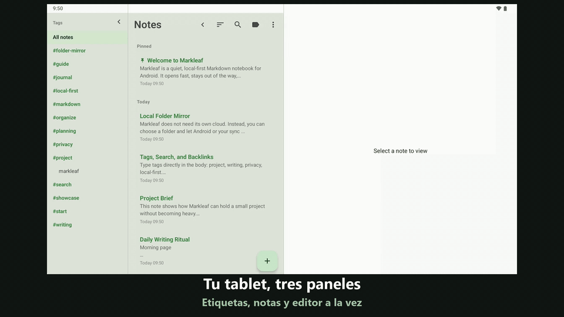

#  Markleaf

<p align="center">
  
</p>

<p align="center">
  <strong>Pensamientos que se acumulan con ligereza, notas Markdown ordenadas</strong><br />
  Una app de notas Markdown minimalista y local-first para Android
</p>

<p align="center">
  <a href="https://trendshift.io/repositories/58116?utm_source=trendshift-badge&utm_medium=badge&utm_campaign=badge-trendshift-58116"></a>
</p>

<p align="center">
  
  
  
  
  
  
</p>

<p align="center">
  <a href="README.md">English</a> ·
  <a href="README.ko.md">한국어</a> ·
  <a href="README.ja.md">日本語</a> ·
  <a href="README.de.md">Deutsch</a> ·
  <strong>Español</strong> ·
  <a href="README.fr.md">Français</a>
</p>

<p align="center">
  <a href="https://github.com/jeiel85/markleaf-android">Repositorio de GitHub</a> ·
  <a href="https://github.com/jeiel85/markleaf-android/discussions">Discussions (sugerencias)</a> ·
  <a href="https://gitlab.com/jeiel85/markleaf-android">Espejo público de GitLab</a>
</p>

<p align="center">
  
</p>

<p align="center">
  <sub>Inserción rápida con <code>/</code> → Markdown estándar → vista previa en vivo</sub>
</p>

<p align="center">
  
</p>

<p align="center">
  <sub>Tablet en 3 paneles — barra de etiquetas · lista de notas · editor en una pantalla</sub>
</p>

---

## 🍃 ¿Qué es Markleaf?

**Markleaf** es una app de notas Markdown para Android diseñada para eliminar lo superfluo y dejarte concentrar en solo dos cosas: capturar y organizar. Tus datos se guardan únicamente en tu dispositivo, y el formato Markdown estándar garantiza la propiedad total y la portabilidad de tus datos. Incluso la sincronización ocurre solo a través de *una carpeta que tú eliges* — Markleaf en sí nunca se conecta a internet.

[**Ver la página de branding**](https://jeiel85.github.io/markleaf-android/) · [Versión actual: v2.32.1](https://github.com/jeiel85/markleaf-android/releases/tag/v2.32.1) · [Política de privacidad](https://jeiel85.github.io/markleaf-android/privacy.html) · [F-Droid](https://f-droid.org/packages/com.markleaf.notes/) · [Google Play](https://play.google.com/store/apps/details?id=com.markleaf.notes)

---

## ✨ Funciones principales

### Escritura y vista previa
- **Inserción rápida con `/`** — busca comandos al inicio de una línea para insertar encabezados, listas, tablas, avisos, wikilinks, imágenes y más como Markdown estándar
- **Vista previa de Markdown en vivo** — alterna al instante entre edición y vista previa, o usa la opción *Mostrar sintaxis Markdown* para coloreado de sintaxis en vivo
- **Tablas GFM / casillas / citas / avisos (`> [!NOTE]` …)** — todo se renderiza en la vista previa
- **Resaltado de sintaxis en bloques de código** — coloreado por tokens para 10 lenguajes: Kotlin, Java, Python, JavaScript/TypeScript, Bash, JSON, YAML, XML, SQL
- **Salto entre referencia y definición de notas al pie (`[^N]`)** — toca el superíndice para desplazarte suavemente hasta la definición
- **Adjuntos de imagen + edición de texto alternativo** — se guardan como copias aisladas en el almacenamiento interno de la app (no requiere permiso de medios)
- **Alternador inteligente de formato Markdown** — envuelve la selección o la palabra junto al cursor en Negrita/Cursiva/Tachado/Código en línea, y toca de nuevo para desenvolver limpiamente un texto que ya está envuelto
- **Atajos de teclado** — Ctrl/Cmd+B, I, K, Shift+S para negrita, cursiva, enlace y tachado con un teclado físico
- **Índice (TOC)** — en el modo de vista previa, salta entre encabezados H1–H3 para navegar notas largas
- **Elección de fuente Serif / Sans** — cambia la superficie de escritura a una tipografía serif para una sensación de libro; los bloques de código siempre se mantienen en monoespaciado
- **Modo enfoque / estadísticas de palabras, caracteres y tiempo de lectura / buscar y reemplazar dentro de una nota**

### Organización y navegación
- **Clasificación por etiquetas + autocompletado** — solo escribe `#etiquetas` en el cuerpo de la nota para indexado automático, sin carpetas; las etiquetas existentes se autocompletan al escribir `#`
- **Wikilinks (`[[Título]]`) + panel de enlaces entrantes** — autocompletado, y ve de un vistazo qué apunta a esta nota
- **Salto rápido (Ctrl+K)** — salto por subcadena de título al estilo Obsidian
- **Búsqueda de texto completo con SQLite FTS** — rápida, hasta el cuerpo de la nota
- **Fijar / archivo / papelera** — la papelera vuelve a preguntar antes de eliminar para siempre

### Sincronización y exportación (principio No-Cloud)
- **Sincronización por carpeta espejo** — refleja cada nota como un archivo `.md` / `.txt` **con el nombre del título** en una carpeta que eliges mediante SAF (Drive/Dropbox/Syncthing/OneDrive/NAS, etc.); si renombras una nota, su archivo la sigue. Markleaf en sí permanece sin conexión; la sincronización se delega a *cualquier app externa que sincronice esa carpeta*
- **Importar archivos externos `.md` / `.txt`** — toca un archivo en tu gestor de archivos o comparte uno desde otra app para incorporarlo como nota nueva (el nombre del archivo se convierte en el título cuando no hay encabezado). Las etiquetas de las notas sincronizadas se reconocen de inmediato
- **Exportar notas individuales o todas como `.md`**
- **Enviar mediante la hoja de compartir del sistema**

### Diseño y accesibilidad
- **Tema verde Markleaf + alternancia Material You** — colores del fondo de pantalla del sistema opcionales en Android 12+
- **Modo oscuro automático** — sigue la configuración del sistema
- **Diseño de 3 paneles para tablet** — barra lateral de etiquetas · lista de notas · editor; toca una etiqueta en la barra lateral para filtrar la lista de notas en el momento (la lista de notas sigue siendo contraíble)
- **Interfaz en 6 idiomas** — recursos en coreano / inglés / español / japonés / francés / alemán
- **Opción de bloquear capturas de pantalla / vista previa en apps recientes** — para notas sensibles

---

## 🔗 Funciona con la carpeta Markdown que ya tienes

Markleaf no tiene un formato de bóveda propio. Apúntalo a una carpeta — incluso a una que Obsidian, Logseq o tu editor de texto ya abren — y trabajará con los archivos que haya allí.

- **Archivos planos que ya son tuyos.** Una nota es un archivo `.md` (o `.txt`). Deja tus archivos existentes en la carpeta y Markleaf los recogerá como notas la próxima vez que pase a primer plano — sin paso de importación.
- **Tu frontmatter sobrevive.** Markleaf añade una pequeña cabecera YAML (`markleaf_id`, marcas de tiempo, pinned/archived) para emparejar un archivo con una nota entre dispositivos, y **todo lo que no reconoce sale de nuevo tal cual** — incluidas las listas en bloque indentadas con las que Obsidian escribe las etiquetas, los mapas anidados, los comentarios y el entrecomillado. La cabecera que añade es un subconjunto estricto de YAML que Obsidian, GitHub y VS Code interpretan sin problemas.
- **La misma sintaxis que ya escribes.** `[[Wikienlaces]]` con panel de retroenlaces, `#etiquetas` en el propio texto, tablas y casillas GFM, llamadas `> [!NOTE]` y un conmutador rápido `Ctrl+K` al estilo de Obsidian.
- **Se reconcilia solo, con cuidado.** Los cambios hechos en otro sitio se incorporan cuando Markleaf vuelve a primer plano (como mucho una vez por minuto). Una edición hecha desde otro editor se detecta aunque ese editor nunca toque el frontmatter de Markleaf: la reconciliación compara el cuerpo, no solo la marca de tiempo. Un archivo solo gana si es realmente más nuevo; si ambos lados cambiaron, la versión remota llega como una nota *aparte* en vez de sobrescribir tus ediciones, y nunca se borra nada automáticamente.

> [!IMPORTANT]
> **Dos cosas antes de apuntar Markleaf a una bóveda real.**
> - **Una carpeta, sin subcarpetas.** Markleaf lee los archivos que están directamente dentro de la carpeta elegida y no baja a subdirectorios. Una bóveda organizada en carpetas anidadas solo se encontrará con Markleaf en su nivel superior — es deliberado: Markleaf organiza por etiquetas, no por carpetas.
> - **Editar una nota renombra su archivo.** Los nombres de los archivos espejo siguen al título de la nota, así que un archivo cuyo nombre difiera de su encabezado se renombrará la primera vez que lo guardes en Markleaf. Si en tu bóveda hay `[[enlaces]]` que apuntan al nombre antiguo, se romperán.
>
> Si tu bóveda tiene muchos niveles o muchos enlaces, apunta Markleaf a una carpeta *aparte* y úsalo como bandeja de entrada móvil desde la que fusionar después, en lugar de como un segundo editor sobre la bóveda misma.

---

## 🛠 Stack tecnológico

Markleaf sigue los estándares actuales de desarrollo Android con un stack moderno y fácil de mantener.

- **UI**: [Jetpack Compose](https://developer.android.com/jetpack/compose) + Material 3 + color dinámico Material You
- **Arquitectura**: separación simple por capas (core / data / domain / feature / ui) + patrón Repository
- **Base de datos**: [Room](https://developer.android.com/training/data-storage/room) — persistencia local respaldada por SQLite, tablas virtuales FTS4 para búsqueda de texto completo
- **Analizador de Markdown**: [commonmark-java](https://github.com/commonmark/commonmark-java) (CommonMark 0.30 + extensiones GFM: tablas, tachado, listas de tareas, notas al pie, YAML frontmatter)
- **Asincronía**: [Kotlin Coroutines](https://kotlinlang.org/docs/coroutines-overview.html) y [Flow](https://kotlinlang.org/docs/flow.html)
- **Storage Access Framework (SAF)** — sincronización por carpeta espejo + adjuntos de imagen
- **Carga de imágenes**: [Coil](https://coil-kt.github.io/coil/) — Apache 2.0, compatible con F-Droid
- **DataStore Preferences** — ajustes de la app
- **Profile Installer 1.4.0 + Macrobenchmark** — medición del baseline profile de arranque en frío (326ms en un TB320FC)
- **Pruebas**: JUnit + Robolectric + tests de regresión visual [Roborazzi](https://github.com/takahirom/roborazzi) (goldens en Linux, umbral 0.005)
- **CI**: GitHub Actions + GitLab CI — builds independientes y releases firmados, launch-smoke, record-roborazzi

---

## 🏗 Arquitectura

Markleaf usa la siguiente estructura por capas para separar responsabilidades y facilitar las pruebas.

```text
com.markleaf.notes
├── core          # lógica central compartida: procesamiento de markdown, adjuntos, sincronización
├── data          # DB de Room, entidades, implementaciones de repositorio (fuente de datos)
├── domain        # modelos, interfaces de repositorio (lógica de negocio)
├── feature       # UI y ViewModels por pantalla (presentación)
│   ├── editor    # editor, buscar/reemplazar, autocompletado de wikilinks, avisos, tablas
│   ├── notes     # lista de notas, salto rápido, archivo
│   ├── search    # búsqueda de texto completo con FTS
│   ├── tags      # índice de etiquetas
│   ├── trash     # papelera / eliminación permanente
│   └── settings  # tema, carpeta de sincronización, bloqueo de capturas, etc.
├── navigation    # configuración de Jetpack Compose Navigation
└── ui            # tema (Markleaf green / Material You), componentes compartidos
```

---

## 🚀 Primeros pasos

### Instalación

> [!NOTE]
> **Las actualizaciones en Google Play están en pausa por ahora.** No se publicarán nuevas versiones en la Play Store hasta que se resuelva un requisito de política de registro de negocio en Corea para el desarrollador individual. Mientras tanto, **obtén la última versión desde F-Droid, GitHub Releases o GitLab Releases.** (Si ya la instalaste desde la Play Store, seguirá funcionando.)

- **F-Droid** *(recomendado)*: [Markleaf en F-Droid](https://f-droid.org/packages/com.markleaf.notes/) — búscalo en el cliente de F-Droid o instálalo con el enlace de arriba. Usa la misma clave de firma (SHA-256 `0be97352…f91a`), así que las actualizaciones continúan sin problemas incluso si instalaste un APK de GitHub o GitLab Releases mediante sideload.
- **Instalación directa del APK**: descarga el APK desde el [release v2.32.1 de GitHub](https://github.com/jeiel85/markleaf-android/releases/tag/v2.32.1), y ejecútalo en tu dispositivo Android.
- **Google Play**: [Markleaf en Google Play](https://play.google.com/store/apps/details?id=com.markleaf.notes) — **las actualizaciones están en pausa** (ver la nota de arriba). Si ya la tienes instalada, seguirá funcionando, pero obtén la última versión desde F-Droid, GitHub o GitLab.

### Compilar desde el código fuente
Si quieres compilar el proyecto o contribuir, sigue estos pasos.

```bash
# Clonar el repositorio
git clone https://github.com/jeiel85/markleaf-android.git

# Entrar en la carpeta del proyecto
cd markleaf-android

# Compilar e instalar
./gradlew installDebug
```

Las correcciones de Markleaf casi siempre empiezan con el informe de otra persona. Quienes los escribieron están en [THANKS.md](THANKS.md).

---

## 🔒 No-Cloud by design

Markleaf en sí nunca se conecta a la red. Que tus datos salgan del dispositivo es *enteramente tu decisión*.

- ✅ **No** declara `android.permission.INTERNET` — Markleaf no realiza solicitudes de red por sí mismo
- ✅ **Sin** servidor / backend propio de Markleaf
- ✅ **Sin** analíticas / anuncios / rastreo / SDKs de código cerrado
- ✅ `android:allowBackup="false"` — los datos de Markleaf quedan excluidos de la copia de seguridad automática de Android y de la transferencia entre dispositivos
- ✅ Los datos solo se mueven por rutas del sistema operativo cuando *tú* exportas, compartes, abres un enlace externo o eliges una carpeta SAF
- ✅ Totalmente de código abierto, auditable por cualquiera bajo Apache 2.0

El funcionamiento exacto de "never leaves your device" está documentado en la [Política de privacidad](docs/PRIVACY.md) y la [No-Cloud Certification](docs/NOCLOUD_CERTIFICATION.md).

---

## 🗺 Hoja de ruta

### v1.x — MVP
- [x] Edición y guardado básico de Markdown
- [x] Filtrado y búsqueda basados en etiquetas
- [x] Nuevo ícono de app y branding
- [x] Vista previa de Markdown en vivo y modo oscuro
- [x] Búsqueda SQLite FTS de alto rendimiento
- [x] Optimización del diseño de 2 paneles para tablet
- [x] Exportación de Markdown de una nota o de todas
- [x] Lanzamiento estable v1.0.0

### v2.x — Expansión clase Bear (actual)
- [x] **v2.3** Analizador CommonMark — avisos, tachado GFM, listas de tareas, notas al pie, YAML frontmatter
- [x] **v2.4–2.5** Wikilinks (`[[Título]]`) + autocompletado + panel de enlaces entrantes
- [x] **v2.6** Adjuntos de imagen + texto alternativo + lightbox
- [x] **v2.7** Sincronización por carpeta espejo SAF (delegada a Drive/Dropbox/Syncthing, sigue sin INTERNET)
- [x] **v2.8** Alternancia Material You + tema verde Markleaf restaurado
- [x] **v2.9** Opción de bloqueo de capturas, pruebas de regresión visual (Roborazzi) establecidas
- [x] **v2.10** Resaltado de sintaxis en bloques de código (10 lenguajes)
- [x] **v2.11** Vista previa de tablas GFM revivida
- [x] **v2.12** Salto rápido (Ctrl+K)
- [x] **v2.13** Buscar / reemplazar dentro de una nota
- [x] **v2.14** Salto por clic entre referencia y definición de notas al pie
- [x] **v2.15** Estabilización del envío a F-Droid y documentación no-cloud
- [x] **v2.16** Widget de pantalla de inicio, bloqueo biométrico, transparencia de código abierto, formato Markdown inteligente
- [x] **v2.17** Importación de archivos externos `.md`/`.txt` por apertura o compartir, correcciones de notas duplicadas y reconocimiento de etiquetas en la sincronización por carpeta
- [x] **v2.18** Archivos de sincronización por carpeta nombrados según el título de la nota (el renombrado se sigue) + elección de `.md`/`.txt`
- [x] **v2.19** Seis notas de ejemplo en el primer inicio + la exportación a PDF/Markdown ya no duplica el título
- [x] **v2.20** Atajos de teclado, autocompletado de `#etiqueta`, índice, fuente serif, diseño de 3 paneles para tablet (barra de etiquetas + filtro en el momento)
- [x] **v2.21** Retroceso predictivo, transiciones pulidas, movimiento de listas/tarjetas, barra de etiquetas para tablets plegables, alternancia de listas de tareas
- [x] **v2.22** Comandos de inserción rápida con `/`, con selección táctil y por teclado físico, y seis menús localizados
- [x] **Lanzamiento público en Google Play** — cualquiera puede instalarla desde la Play Store

---

## 📜 Licencia

Este proyecto está bajo la licencia **Apache License 2.0**. Consulta el archivo `LICENSE` para más detalles.

---

<p align="center">
  Made with ❤️ by <strong>Markleaf Team</strong>
</p>
