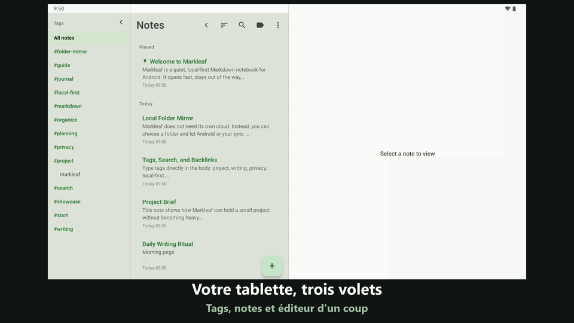

#  Markleaf

<p align="center">
  
</p>

<p align="center">
  <strong>Des pensées qui s'accumulent en douceur, des notes Markdown bien rangées</strong><br />
  Une application de notes Markdown minimaliste et local-first pour Android
</p>

<p align="center">
  <a href="https://trendshift.io/repositories/58116?utm_source=trendshift-badge&utm_medium=badge&utm_campaign=badge-trendshift-58116"></a>
</p>

<p align="center">
  
  
  
  
  
  
</p>

<p align="center">
  <a href="README.md">English</a> ·
  <a href="README.ko.md">한국어</a> ·
  <a href="README.ja.md">日本語</a> ·
  <a href="README.zh.md">简体中文</a> ·
  <a href="README.de.md">Deutsch</a> ·
  <a href="README.es.md">Español</a> ·
  <strong>Français</strong> ·
  <a href="README.hr.md">Hrvatski</a>
</p>

<p align="center">
  <a href="https://github.com/jeiel85/markleaf-android">Dépôt GitHub</a> ·
  <a href="https://github.com/jeiel85/markleaf-android/discussions">Discussions (retours)</a> ·
  <a href="https://gitlab.com/jeiel85/markleaf-android">Miroir GitLab (archivé)</a>
</p>

<p align="center">
  
</p>

<p align="center">
  <sub>Insertion rapide avec <code>/</code> → Markdown standard → aperçu en direct</sub>
</p>

<p align="center">
  
</p>

<p align="center">
  <sub>Tablette en 3 volets — barre de tags · liste de notes · éditeur sur un seul écran</sub>
</p>

---

## 🍃 Qu'est-ce que Markleaf ?

**Markleaf** est une application Android de prise de notes Markdown conçue pour éliminer le superflu afin que vous puissiez vous concentrer sur seulement deux choses : capturer et organiser. Vos données sont stockées uniquement sur votre appareil, et le format Markdown standard garantit une propriété et une portabilité complètes. Même la synchronisation ne passe que par *un dossier que vous choisissez* — Markleaf lui-même ne se connecte jamais à internet.

[**Voir la page de branding**](https://jeiel85.github.io/markleaf-android/) · [Version actuelle : v2.32.6](https://github.com/jeiel85/markleaf-android/releases/tag/v2.32.6) · [Politique de confidentialité](https://jeiel85.github.io/markleaf-android/privacy.html) · [F-Droid](https://f-droid.org/packages/com.markleaf.notes/) · [Google Play](https://play.google.com/store/apps/details?id=com.markleaf.notes)

---

## ✨ Fonctionnalités principales

### Écriture et aperçu
- **Insertion rapide avec `/`** — recherchez des commandes en début de ligne pour insérer titres, listes, tableaux, encadrés, wikiliens, images et plus encore, en Markdown standard
- **Aperçu Markdown en direct** — basculez instantanément entre édition et aperçu, ou utilisez l'option *Afficher la syntaxe Markdown* pour une coloration syntaxique en direct
- **Tableaux GFM / cases à cocher / citations / encadrés (`> [!NOTE]` …)** — tous rendus dans l'aperçu
- **Coloration syntaxique des blocs de code** — coloration par tokens pour 10 langages : Kotlin, Java, Python, JavaScript/TypeScript, Bash, JSON, YAML, XML, SQL
- **Saut référence ↔ définition pour les notes de bas de page (`[^N]`)** — appuyez sur l'exposant pour défiler en douceur jusqu'à la définition
- **Pièces jointes image + édition du texte alternatif** — conservées comme copies isolées dans le stockage interne de l'application (aucune permission média requise)
- **Bascule de mise en forme Markdown intelligente** — entourez la sélection ou le mot autour du curseur de Gras/Italique/Barré/Code en ligne, et appuyez à nouveau pour retirer proprement la mise en forme d'un texte déjà entouré
- **Raccourcis clavier** — Ctrl/Cmd+B, I, K, Maj+S pour le gras, l'italique, le lien et le barré sur un clavier physique
- **Table des matières (TOC)** — en mode aperçu, sautez vers les titres H1–H3 pour naviguer dans les notes longues
- **Choix de police Serif / Sans** — basculez la surface d'écriture vers une police avec empattements pour un rendu proche du livre ; les blocs de code restent toujours à chasse fixe
- **Mode concentration / statistiques de mots, caractères et temps de lecture / recherche et remplacement dans une note**

### Organisation et navigation
- **Classification par étiquettes + auto-complétion** — écrivez simplement des `#étiquettes` dans le corps du texte pour une indexation automatique, sans dossiers ; les étiquettes existantes se complètent automatiquement lorsque vous tapez `#`
- **Wikiliens (`[[Titre]]`) + panneau des liens entrants** — auto-complétion, et voyez en un coup d'œil ce qui pointe vers cette note
- **Accès rapide (Ctrl+K)** — saut par sous-chaîne de titre façon Obsidian
- **Recherche plein texte avec SQLite FTS** — rapide, jusque dans le corps du texte
- **Épingler / archives / corbeille** — la corbeille redemande confirmation avant la suppression définitive

### Synchronisation et export (principe No-Cloud)
- **Synchronisation en miroir de dossier** — reflète chaque note sous forme de fichier `.md` / `.txt` **nommé selon le titre** dans un dossier que vous choisissez via SAF (Drive/Dropbox/Syncthing/OneDrive/NAS, etc.) ; renommez une note et son fichier suit. Markleaf lui-même reste hors ligne ; la synchronisation est déléguée à *l'application externe qui synchronise ce dossier*
- **Ouvrir un fichier `.md` / `.txt` pour le lire** — *Ouvrir un fichier…* dans le menu ⋮, ou un appui dans votre gestionnaire de fichiers, ouvre le fichier rendu et en lecture seule ; aucune note n'est créée tant que vous n'appuyez pas sur *Enregistrer comme note* (le nom du fichier devient le titre s'il n'y a pas de titre dans le texte). Un fichier partagé depuis une autre application est toujours importé immédiatement. Les étiquettes des notes importées par synchronisation sont reconnues immédiatement
- **Export des notes individuelles ou de toutes les notes en `.md`**
- **Envoi via la feuille de partage du système**

### Design et accessibilité
- **Thème vert Markleaf + bascule Material You** — couleurs du fond d'écran système en option sur Android 12+
- **Mode sombre automatique** — suit le paramètre système
- **Disposition en 3 panneaux pour tablette** — barre latérale des étiquettes · liste des notes · éditeur ; appuyez sur une étiquette dans la barre latérale pour filtrer la liste des notes sur place (la liste des notes reste réductible)
- **Interface en 8 langues** — ressources en coréen / anglais / espagnol / japonais / français / allemand / chinois simplifié / croate
- **Option de blocage des captures d'écran / aperçu dans les applications récentes** — pour les notes sensibles

---

## 🔗 Fonctionne avec le dossier Markdown que vous avez déjà

Markleaf n'a pas de format de coffre qui lui soit propre. Pointez-le vers un dossier — y compris un dossier qu'Obsidian, Logseq ou votre éditeur de texte ouvrent déjà — et il travaille sur les fichiers qui s'y trouvent.

- **Des fichiers simples, déjà les vôtres.** Une note est un fichier `.md` (ou `.txt`). Déposez vos fichiers existants dans le dossier : Markleaf les reprend comme notes dès son prochain passage au premier plan — sans étape d'import.
- **Votre frontmatter est préservé.** Markleaf ajoute un petit en-tête YAML (`markleaf_id`, horodatages, pinned/archived) pour associer un fichier à une note d'un appareil à l'autre, et **tout ce qu'il ne connaît pas ressort tel quel** — y compris les listes en bloc indentées dans lesquelles Obsidian écrit les tags, les tables imbriquées, les commentaires et les guillemets. L'en-tête qu'il ajoute est un sous-ensemble strict de YAML qu'Obsidian, GitHub et VS Code analysent tous.
- **La syntaxe que vous écrivez déjà.** `[[Wikiliens]]` avec panneau de rétroliens, `#tags` directement dans le texte, tableaux et cases à cocher GFM, encarts `> [!NOTE]`, et un sélecteur rapide `Ctrl+K` façon Obsidian.
- **Se réconcilie tout seul, avec prudence.** Les changements faits ailleurs sont repris quand Markleaf revient au premier plan (au plus une fois par minute). Une modification faite depuis un autre éditeur est détectée même si celui-ci ne touche jamais au frontmatter de Markleaf : la réconciliation compare le corps du texte, pas seulement l'horodatage. Un fichier ne l'emporte que s'il est réellement plus récent ; si les deux côtés ont bougé, la version distante arrive comme une note *distincte* au lieu d'écraser vos modifications, et rien n'est jamais supprimé automatiquement.

> [!IMPORTANT]
> **Deux points à connaître avant de pointer Markleaf vers un vrai coffre.**
> - **Un dossier, pas de sous-dossiers.** Markleaf lit les fichiers situés directement dans le dossier choisi et ne descend pas dans les sous-répertoires. Un coffre organisé en dossiers imbriqués ne rencontrera Markleaf qu'à son niveau supérieur — c'est délibéré : Markleaf classe par tags plutôt que par dossiers.
> - **Modifier une note renomme son fichier.** Les noms des fichiers miroirs suivent le titre de la note ; un fichier dont le nom diffère de son titre sera donc renommé au premier enregistrement dans Markleaf. Si des `[[liens]]` de votre coffre pointent vers l'ancien nom, ils casseront.
>
> Si votre coffre est très arborescent ou riche en liens, pointez Markleaf vers un dossier *séparé* et utilisez-le comme boîte de réception mobile à fusionner ensuite, plutôt que comme second éditeur sur le coffre lui-même.

---

## 🛠 Stack technique

Markleaf suit les standards actuels du développement Android avec un stack moderne et facile à maintenir.

- **UI** : [Jetpack Compose](https://developer.android.com/jetpack/compose) + Material 3 + couleur dynamique Material You
- **Architecture** : séparation simple en couches (core / data / domain / feature / ui) + patron Repository
- **Base de données** : [Room](https://developer.android.com/training/data-storage/room) — persistance locale reposant sur SQLite, tables virtuelles FTS4 pour la recherche plein texte
- **Analyseur Markdown** : [commonmark-java](https://github.com/commonmark/commonmark-java) (CommonMark 0.30 + extensions GFM : tableaux, barré, listes de tâches, notes de bas de page, YAML frontmatter)
- **Asynchrone** : [Kotlin Coroutines](https://kotlinlang.org/docs/coroutines-overview.html) et [Flow](https://kotlinlang.org/docs/flow.html)
- **Storage Access Framework (SAF)** — synchronisation en miroir de dossier + pièces jointes image
- **Chargement d'images** : [Coil](https://coil-kt.github.io/coil/) — Apache 2.0, adapté à F-Droid
- **DataStore Preferences** — paramètres de l'application
- **Profile Installer 1.4.0 + Macrobenchmark** — mesure du baseline profile au démarrage à froid (326ms sur un TB320FC)
- **Tests** : JUnit + Robolectric + tests de régression visuelle [Roborazzi](https://github.com/takahirom/roborazzi) (goldens Linux, seuil 0.005)
- **CI** : GitHub Actions — build et instrumented tests sont des vérifications obligatoires, plus launch-smoke, record-roborazzi et la release signée lors du tag

---

## 🏗 Architecture

Markleaf utilise la structure en couches suivante pour séparer les responsabilités et faciliter les tests.

```text
com.markleaf.notes
├── core          # logique cœur partagée : traitement markdown, pièces jointes, synchronisation
├── data          # DB Room, entités, implémentations de repository (source de données)
├── domain        # modèles, interfaces de repository (logique métier)
├── feature       # UI et ViewModels par écran (présentation)
│   ├── editor    # éditeur, recherche/remplacement, auto-complétion des wikiliens, encadrés, tableaux
│   ├── notes     # liste des notes, accès rapide, archives
│   ├── search    # recherche plein texte FTS
│   ├── tags      # index des étiquettes
│   ├── trash     # corbeille / suppression définitive
│   └── settings  # thème, dossier de synchronisation, blocage des captures, etc.
├── navigation    # configuration de Jetpack Compose Navigation
└── ui            # thème (Markleaf green / Material You), composants partagés
```

---

## 🚀 Prise en main

### Installation

> [!NOTE]
> **Les mises à jour sur Google Play sont actuellement en pause.** Aucune nouvelle version ne sera publiée sur le Play Store tant qu'une exigence de politique d'enregistrement d'entreprise en Corée pour le développeur indépendant ne sera pas résolue. Pour la version actuelle, utilisez **GitHub Releases**. Une fois que la compilation F-Droid est à jour, F-Droid reste le canal de mise à jour recommandé. (Si vous l'avez déjà installée depuis le Play Store, elle continue de fonctionner.)

- **F-Droid** *(recommandé pour les mises à jour automatiques)* : [Markleaf sur F-Droid](https://f-droid.org/packages/com.markleaf.notes/) — recherchez-le dans le client F-Droid ou installez-le via le lien ci-dessus. Le catalogue peut être publié après GitHub ; s'il n'affiche pas encore la version actuelle, utilisez GitHub Releases ci-dessous. Il utilise la même clé de signature (SHA-256 `0be97352…f91a`), donc les mises à jour continuent sans interruption même si vous installez d'abord un APK GitHub par sideload.
- **Installation directe de l'APK** : téléchargez l'APK depuis la [release GitHub v2.32.6](https://github.com/jeiel85/markleaf-android/releases/tag/v2.32.6), puis exécutez-le sur votre appareil Android.
- **Google Play** : [Markleaf sur Google Play](https://play.google.com/store/apps/details?id=com.markleaf.notes) — **les mises à jour sont en pause** (voir la note ci-dessus). Si vous l'avez déjà, elle continue de fonctionner ; obtenez la version actuelle via GitHub Releases ou via F-Droid une fois publiée.

### Compilation depuis les sources
Si vous souhaitez compiler le projet ou contribuer, suivez ces étapes.

```bash
# Cloner le dépôt
git clone https://github.com/jeiel85/markleaf-android.git

# Entrer dans le dossier du projet
cd markleaf-android

# Compiler et installer
./gradlew installDebug
```

Les corrections de Markleaf commencent presque toujours par le signalement de quelqu'un d'autre. Ces personnes sont listées dans [THANKS.md](THANKS.md).

---

## 🔒 No-Cloud by design

Markleaf lui-même ne se connecte jamais au réseau. Que vos données quittent l'appareil ou non est *entièrement votre choix*.

- ✅ **Aucune** déclaration de `android.permission.INTERNET` — Markleaf n'effectue lui-même aucune requête réseau
- ✅ **Aucun** serveur / backend Markleaf
- ✅ **Aucune** analyse / publicité / traçage / SDK à code source fermé
- ✅ `android:allowBackup="false"` — les données de Markleaf sont exclues de la sauvegarde automatique Android et du transfert entre appareils
- ✅ Les données ne circulent par les chemins du système que lorsque *vous* exportez, partagez, ouvrez un lien externe ou choisissez un dossier SAF
- ✅ Entièrement open source, vérifiable par n'importe qui sous licence Apache 2.0

Le fonctionnement exact de « never leaves your device » est documenté dans la [Politique de confidentialité](docs/PRIVACY.md) et la [No-Cloud Certification](docs/NOCLOUD_CERTIFICATION.md).

---

## 🗺 Feuille de route

### v1.x — MVP
- [x] Édition et sauvegarde Markdown de base
- [x] Filtrage et recherche par étiquettes
- [x] Nouvelle icône d'application et nouveau branding
- [x] Aperçu Markdown en direct et mode sombre
- [x] Recherche SQLite FTS haute performance
- [x] Optimisation de la disposition à 2 panneaux pour tablette
- [x] Export Markdown d'une note ou de toutes les notes
- [x] Version stable v1.0.0

### v2.x — Extension classe Bear (actuelle)
- [x] **v2.3** Analyseur CommonMark — encadrés, barré GFM, listes de tâches, notes de bas de page, YAML frontmatter
- [x] **v2.4–2.5** Wikiliens (`[[Titre]]`) + auto-complétion + panneau des liens entrants
- [x] **v2.6** Pièces jointes image + texte alternatif + lightbox
- [x] **v2.7** Synchronisation en miroir de dossier SAF (délégation à Drive/Dropbox/Syncthing, toujours sans INTERNET)
- [x] **v2.8** Bascule Material You + thème vert Markleaf restauré
- [x] **v2.9** Option de blocage des captures d'écran, tests de régression visuelle (Roborazzi) mis en place
- [x] **v2.10** Coloration syntaxique des blocs de code (10 langages)
- [x] **v2.11** Aperçu des tableaux GFM ressuscité
- [x] **v2.12** Accès rapide (Ctrl+K)
- [x] **v2.13** Recherche / remplacement dans une note
- [x] **v2.14** Saut par clic référence ↔ définition pour les notes de bas de page
- [x] **v2.15** Stabilisation de la soumission F-Droid et documentation no-cloud
- [x] **v2.16** Widget d'écran d'accueil, verrouillage biométrique, transparence open source, mise en forme Markdown intelligente
- [x] **v2.17** Import par ouverture/partage de fichiers externes `.md`/`.txt`, corrections des notes dupliquées et de la reconnaissance des étiquettes lors de la synchronisation de dossier
- [x] **v2.18** Fichiers de synchronisation de dossier nommés selon le titre de la note (le renommage suit) + choix `.md`/`.txt`
- [x] **v2.19** Six notes d'exemple au premier lancement + l'export PDF/Markdown ne duplique plus le titre
- [x] **v2.20** Raccourcis clavier, auto-complétion `#étiquette`, table des matières, police serif, disposition tablette à 3 panneaux (barre d'étiquettes + filtrage sur place)
- [x] **v2.21** Retour prédictif, transitions affinées, animation des listes/cartes, barre d'étiquettes rétractable pour tablette pliable, bascule des cases des listes de tâches
- [x] **v2.22** Commandes d'insertion rapide `/` avec sélection tactile et au clavier physique, et six menus localisés
- [x] **Lancement public sur Google Play** — n'importe qui peut l'installer depuis le Play Store

---

## 📜 Licence

Ce projet est distribué sous licence **Apache License 2.0**. Consultez le fichier `LICENSE` pour plus de détails.

---

<p align="center">
  Made with ❤️ by <strong>Markleaf Team</strong>
</p>
