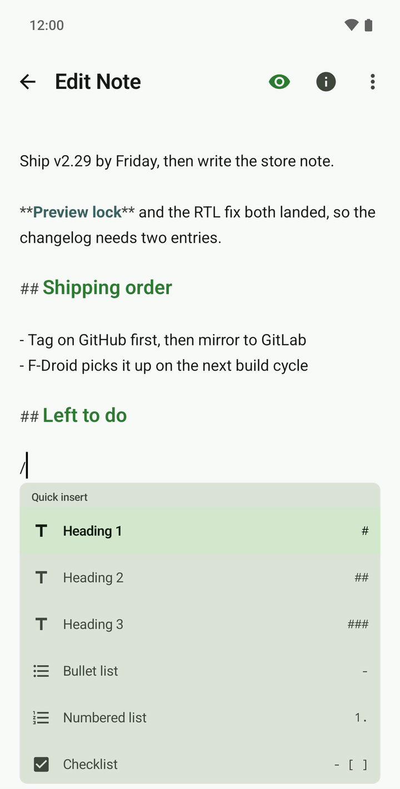
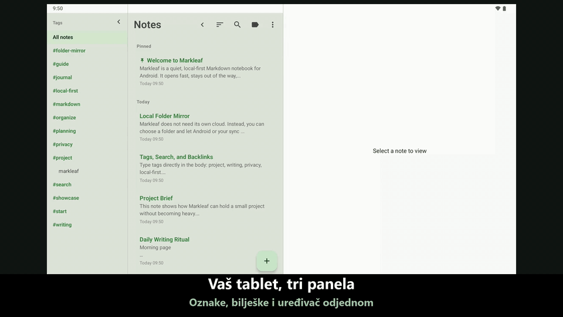

#  Markleaf

<p align="center">
  
</p>

<p align="center">
  <strong>Misli koje se lagano slažu, uredne Markdown bilješke</strong><br />
  Primarno lokalna, minimalistična aplikacija za Markdown bilješke za Android
</p>

<p align="center">
  <a href="https://trendshift.io/repositories/58116?utm_source=trendshift-badge&utm_medium=badge&utm_campaign=badge-trendshift-58116"></a>
</p>

<p align="center">
  
  
  
  
  
  
</p>

<p align="center">
  <a href="README.md">English</a> ·
  <a href="README.ko.md">한국어</a> ·
  <a href="README.ja.md">日本語</a> ·
  <a href="README.zh.md">简体中文</a> ·
  <a href="README.de.md">Deutsch</a> ·
  <a href="README.es.md">Español</a> ·
  <a href="README.fr.md">Français</a> ·
  <strong>Hrvatski</strong>
</p>

<p align="center">
  <a href="https://github.com/jeiel85/markleaf-android">GitHub repozitorij</a> ·
  <a href="https://github.com/jeiel85/markleaf-android/discussions">Rasprave (povratne informacije)</a> ·
  <a href="https://gitlab.com/jeiel85/markleaf-android">GitLab zrcalo (arhivirano)</a>
</p>

<p align="center">
  
</p>

<p align="center">
  <sub><code>/</code> brzo umetanje → obični Markdown → pretpregled uživo</sub>
</p>

<p align="center">
  
</p>

<p align="center">
  <sub>Tablet u tri panela — traka s oznakama · popis bilješki · uređivač na jednom zaslonu</sub>
</p>

---

## 🍃 Što je Markleaf?

**Markleaf** je Android aplikacija za Markdown bilješke osmišljena tako da ukloni nered kako biste se mogli usredotočiti na samo dvije stvari: bilježenje i organiziranje. Vaši se podaci pohranjuju isključivo na vašem uređaju, a standardni Markdown jamči potpuno vlasništvo i prenosivost. Čak se i sinkronizacija odvija samo kroz *mapu koju sami odaberete* — Markleaf sam nikada ne izlazi na mrežu.

[**Pogledajte stranicu projekta**](https://jeiel85.github.io/markleaf-android/) · [Trenutačna verzija: v2.34.1](https://github.com/jeiel85/markleaf-android/releases/tag/v2.34.1) · [Pravila privatnosti](https://jeiel85.github.io/markleaf-android/privacy.html) · [F-Droid](https://f-droid.org/packages/com.markleaf.notes/) · [Google Play](https://play.google.com/store/apps/details?id=com.markleaf.notes)

---

## ✨ Glavne mogućnosti

### Pisanje i pretpregled
- **`/` brzo umetanje** — pretražite naredbe na početku retka i umetnite naslove, popise, tablice, istaknute okvire, wikipoveznice, slike i još mnogo toga kao standardni Markdown
- **Markdown pretpregled uživo** — prebacujte se trenutačno između uređivanja i pretpregleda ili uključite opciju *Prikaži Markdown sintaksu* za bojanje sintakse uživo
- **GFM tablice / potvrdni okviri / blok-citati / istaknuti okviri (`> [!NOTE]` …)** — sve se prikazuje u pretpregledu
- **Isticanje sintakse u blokovima koda** — bojanje tokena za 10 jezika: Kotlin, Java, Python, JavaScript/TypeScript, Bash, JSON, YAML, XML, SQL
- **Skok između reference i definicije fusnote (`[^N]`)** — dodirnite eksponent za glatko pomicanje do definicije
- **Prilozi slika + uređivanje alternativnog teksta** — čuvaju se kao izolirane kopije u internoj pohrani aplikacije (bez dozvole za medije)
- **Pametno prebacivanje Markdown formatiranja** — omotajte odabir ili riječ oko pokazivača u podebljano/kurziv/precrtano/kod, a ponovnim dodirom uredno uklonite već postojeće oznake
- **Tipkovni prečaci** — Ctrl/Cmd+B, I, K, Shift+S za podebljano, kurziv, poveznicu i precrtano na hardverskoj tipkovnici
- **Sadržaj (TOC)** — u načinu pretpregleda skočite na naslove H1–H3 i tako se krećite kroz duge bilješke
- **Izbor serifnog / beserifnog pisma** — prebacite površinu za pisanje na serifno pismo za dojam knjige; blokovi koda uvijek ostaju jednoširinski
- **Način fokusa / statistika riječi, znakova i vremena čitanja / pronalaženje i zamjena unutar bilješke**

### Organiziranje i kretanje
- **Razvrstavanje po oznakama + automatsko dovršavanje** — samo upišite `#oznake` u tijelo bilješke za automatsko indeksiranje, bez mapa; postojeće se oznake dovršavaju dok tipkate `#`
- **Wikipoveznice (`[[Naslov]]`) + panel povratnih poveznica** — automatsko dovršavanje i pregled onoga što upućuje na ovu bilješku
- **Brzo prebacivanje (Ctrl+K)** — skok po dijelu naslova u stilu Obsidiana
- **SQLite FTS pretraživanje punog teksta** — brzo, sve do tijela teksta
- **Prikvačivanje / arhiviranje / smeće** — smeće pita još jednom prije trajnog brisanja

### Sinkronizacija i izvoz (načelo bez oblaka)
- **Zrcaljenje mape** — zrcali svaku bilješku kao `.md` / `.txt` datoteku **nazvanu po naslovu** u mapu koju odaberete putem SAF-a (Drive/Dropbox/Syncthing/OneDrive/NAS itd.); preimenujte bilješku i njezina datoteka slijedi. Markleaf sam ostaje izvan mreže; sinkronizacija je prepuštena *bilo kojoj vanjskoj aplikaciji koja sinkronizira tu mapu*
- **Otvorite `.md` / `.txt` datoteku i pročitajte je** — *Otvori datoteku…* u izborniku ⋮ ili dodir u upravitelju datoteka otvara datoteku prikazanu i samo za čitanje; ništa se ne pridružuje vašim bilješkama dok ne dodirnete *Spremi kao bilješku* (ime datoteke postaje naslov kad nema naslova u tekstu). Dijeljenje datoteke u Markleaf iz druge aplikacije i dalje je odmah uvozi. Oznake u sinkroniziranim bilješkama prepoznaju se odmah
- **Izvoz pojedinačnih / svih bilješki kao `.md`**
- **Slanje kroz sustavni izbornik za dijeljenje**

### Dizajn i pristupačnost
- **Markleaf zelena tema + Material You prekidač** — sistemske boje pozadinske slike na Androidu 12+ po izboru
- **Automatski tamni način** — prati postavku sustava
- **Raspored u tri panela za tablete** — bočna traka s oznakama · popis bilješki · uređivač; dodirnite oznaku u bočnoj traci da filtrirate popis bilješki na mjestu (popis se i dalje može sažeti)
- **Sučelje na 8 jezika** — hrvatski / korejski / engleski / španjolski / japanski / francuski / njemački / kineski (pojednostavljeni)
- **Opcija blokiranja snimaka zaslona / pretpregleda u nedavnim aplikacijama** — za osjetljive bilješke

---

## 🔗 Radi s Markdown mapom koju već imate

Markleaf nema vlastiti format trezora. Usmjerite ga na mapu — uključujući onu koju Obsidian, Logseq ili vaš uređivač teksta već otvaraju — i on radi s datotekama koje su ondje.

- **Obične datoteke, već vaše.** Jedna bilješka je jedna `.md` (ili `.txt`) datoteka. Ubacite postojeće datoteke u mapu i Markleaf će ih pokupiti kao bilješke čim se sljedeći put vrati u prvi plan — bez koraka uvoza.
- **Vaš frontmatter preživljava.** Markleaf dodaje malo YAML zaglavlje (`markleaf_id`, vremenske oznake, prikvačeno/arhivirano) kako bi mogao povezati datoteku s bilješkom na svim uređajima, a **sve što ne prepoznaje vraća van bajt po bajt** — uključujući uvučeni blok popisa u koji Obsidian upisuje oznake, ugniježđene mape, komentare i navodnike. Zaglavlje koje dodaje strogi je podskup YAML-a koji razumiju Obsidian, GitHub i VS Code.
- **Ista sintaksa koju već pišete.** `[[Wikipoveznice]]` s panelom povratnih poveznica, `#oznake` unutar teksta, GFM tablice i potvrdni okviri, `> [!NOTE]` istaknuti okviri i brzo prebacivanje `Ctrl+K` u stilu Obsidiana.
- **Usklađuje se sam, oprezno.** Promjene napravljene drugdje povlače se kad se Markleaf vrati u prvi plan (najviše jednom u minuti). Uređivanje iz drugog uređivača vidi se i ako taj uređivač nikad ne dira Markleafov frontmatter — usklađivanje uspoređuje tijelo, ne samo vremensku oznaku. Datoteka pobjeđuje samo kad je uistinu novija; ako su se obje strane pomaknule, udaljena verzija stiže kao *zasebna* bilješka umjesto da prebriše vaše izmjene, a ništa se nikada ne briše automatski.

> [!IMPORTANT]
> **Dvije stvari koje treba znati prije nego što Markleaf usmjerite na pravi trezor.**
> - **Jedna mapa, bez podmapa.** Markleaf čita datoteke izravno unutar mape koju odaberete i ne ulazi u podmape. Trezor organiziran u ugniježđene mape susrest će se s Markleafom samo na svojoj najvišoj razini — namjerno, jer Markleaf organizira po oznakama, a ne po mapama.
> - **Uređivanje bilješke preimenuje njezinu datoteku.** Imena zrcaljenih datoteka prate naslov bilješke, pa se datoteka čije se ime razlikuje od njezina naslova preimenuje pri prvom spremanju u Markleafu. Ondje gdje `[[poveznice]]` u vašem trezoru upućuju na staro ime datoteke, one će se prekinuti.
>
> Ako je vaš trezor duboko ugniježđen ili prepun poveznica, usmjerite Markleaf na *zasebnu* mapu i tretirajte je kao mobilnu pristiglu poštu iz koje spajate, a ne kao drugi uređivač nad samim trezorom.

---

## 🛠 Tehnologije

Markleaf slijedi aktualne standarde razvoja za Android s modernim stogom koji se lako održava.

- **Sučelje**: [Jetpack Compose](https://developer.android.com/jetpack/compose) + Material 3 + Material You dinamičke boje
- **Arhitektura**: jednostavno slojevito razdvajanje (core / data / domain / feature / ui) + Repository obrazac
- **Baza podataka**: [Room](https://developer.android.com/training/data-storage/room) — lokalna pohrana na SQLite-u, FTS4 virtualne tablice za pretraživanje punog teksta
- **Markdown parser**: [commonmark-java](https://github.com/commonmark/commonmark-java) (CommonMark 0.30 + GFM proširenja: tablice, precrtavanje, popisi zadataka, fusnote, YAML frontmatter)
- **Asinkronost**: [Kotlin Coroutines](https://kotlinlang.org/docs/coroutines-overview.html) i [Flow](https://kotlinlang.org/docs/flow.html)
- **Storage Access Framework (SAF)** — zrcaljenje mape i prilozi slika
- **Učitavanje slika**: [Coil](https://coil-kt.github.io/coil/) — Apache 2.0, prihvatljivo za F-Droid
- **DataStore Preferences** — postavke aplikacije
- **Profile Installer 1.4.0 + Macrobenchmark** — mjerenje baseline profila za hladno pokretanje (326 ms na TB320FC)
- **Testiranje**: JUnit + Robolectric + [Roborazzi](https://github.com/takahirom/roborazzi) vizualni regresijski testovi (Linux zlatni uzorci, prag 0,005)
- **CI**: GitHub Actions — build i instrumentirani testovi obvezne su provjere, uz launch-smoke, record-roborazzi i potpisano izdanje na oznaci

---

## 🏗 Arhitektura

Markleaf koristi sljedeću slojevitu strukturu radi razdvajanja odgovornosti i mogućnosti testiranja.

```text
com.markleaf.notes
├── core          # zajednička jezgra: obrada markdowna, prilozi, sinkronizacija
├── data          # Room baza, entiteti, implementacije repozitorija (izvor podataka)
├── domain        # modeli, sučelja repozitorija (poslovna logika)
├── feature       # sučelje i ViewModeli po zaslonu (prezentacija)
│   ├── editor    # uređivač, pronalaženje/zamjena, dovršavanje wikipoveznica, istaknuti okviri, tablice
│   ├── notes     # popis bilješki, brzo prebacivanje, arhiva
│   ├── search    # FTS pretraživanje punog teksta
│   ├── tags      # indeks oznaka
│   ├── trash     # smeće / trajno brisanje
│   └── settings  # tema, mapa za sinkronizaciju, blokiranje snimaka zaslona itd.
├── navigation    # postavljanje Jetpack Compose Navigationa
└── ui            # tema (Markleaf zelena / Material You), zajedničke komponente
```

---

## 🚀 Početak rada

### Instalacija

> [!NOTE]
> **Ažuriranja na Google Playu trenutačno su zaustavljena.** Nove verzije neće se objavljivati na Play Storeu dok se ne riješi korejski propis o registraciji obrta za samostalnog razvijatelja. Za trenutačno izdanje koristite **GitHub Releases**. F-Droid ostaje preporučeni put ažuriranja kad njegov build dostigne izdanje. (Ako ste je već instalirali s Play Storea, nastavlja raditi.)

- **F-Droid** *(preporučeno za automatska ažuriranja)*: [Markleaf na F-Droidu](https://f-droid.org/packages/com.markleaf.notes/) — potražite u F-Droid klijentu ili instalirajte putem poveznice iznad. Njegov katalog može objaviti nakon GitHuba; ako još ne prikazuje trenutačnu verziju, koristite GitHub Releases ispod. Koristi isti ključ za potpisivanje (SHA-256 `0be97352…f91a`), pa se ažuriranja nastavljaju bez prekida i ako prvo ručno instalirate APK s GitHuba.
- **Izravna instalacija APK-a**: preuzmite APK iz [GitHub izdanja v2.34.1](https://github.com/jeiel85/markleaf-android/releases/tag/v2.34.1) i pokrenite ga na svom Android uređaju.
- **Google Play**: [Markleaf na Google Playu](https://play.google.com/store/apps/details?id=com.markleaf.notes) — **ažuriranja su zaustavljena** (vidi napomenu iznad). Ako je već imate, nastavlja raditi; za trenutačnu verziju koristite GitHub Releases ili F-Droid kad ondje postane dostupna.

### Izgradnja iz izvornog koda
Ako želite izgraditi aplikaciju ili doprinijeti, slijedite ove korake.

```bash
# Klonirajte repozitorij
git clone https://github.com/jeiel85/markleaf-android.git

# Uđite u mapu projekta
cd markleaf-android

# Izgradite i instalirajte
./gradlew installDebug
```

Markleafovi popravci grešaka najčešće počinju kao nečija tuđa prijava. Ljudi koji su ih napisali navedeni su u [THANKS.md](THANKS.md).

---

## 🔒 Bez oblaka po dizajnu

Markleaf sam nikada ne izlazi na mrežu. Hoće li vaši podaci napustiti uređaj, *u potpunosti je vaš izbor*.

- ✅ **Bez** deklarirane dozvole `android.permission.INTERNET` — Markleaf sam ne šalje mrežne zahtjeve
- ✅ **Bez** Markleaf poslužitelja / pozadinske usluge
- ✅ **Bez** analitike / oglasa / praćenja / SDK-ova zatvorenog koda
- ✅ `android:allowBackup="false"` — Markleafovi podaci izuzeti su iz Androidova automatskog sigurnosnog kopiranja i prijenosa na novi uređaj
- ✅ Podaci se kreću samo kroz putove operacijskog sustava kad *vi* izvezete, podijelite, otvorite vanjsku poveznicu ili odaberete SAF mapu
- ✅ Potpuno otvoren kod, svatko ga može provjeriti pod licencom Apache 2.0

Kako točno funkcionira „nikad ne napušta vaš uređaj” dokumentirano je u [Pravilima privatnosti](docs/PRIVACY.md) i [Potvrdi o radu bez oblaka](docs/NOCLOUD_CERTIFICATION.md).

---

## 🗺 Plan razvoja

### v1.x — MVP
- [x] Osnovno uređivanje i spremanje Markdowna
- [x] Filtriranje i pretraživanje po oznakama
- [x] Nova ikona aplikacije i vizualni identitet
- [x] Markdown pretpregled uživo i tamni način
- [x] Brzo SQLite FTS pretraživanje
- [x] Optimizacija rasporeda u dva panela za tablete
- [x] Izvoz pojedinačne / svih bilješki u Markdown
- [x] Stabilno izdanje v1.0.0

### v2.x — proširenje razreda Bear (trenutačno)
- [x] **v2.3** CommonMark parser — istaknuti okviri, GFM precrtavanje, popisi zadataka, fusnote, YAML frontmatter
- [x] **v2.4–2.5** Wikipoveznice (`[[Naslov]]`) + automatsko dovršavanje + panel povratnih poveznica
- [x] **v2.6** Prilozi slika + alternativni tekst + svjetlosni okvir
- [x] **v2.7** SAF zrcaljenje mape (prepuštanje Driveu/Dropboxu/Syncthingu, i dalje bez INTERNETA)
- [x] **v2.8** Material You prekidač + vraćena Markleaf zelena tema
- [x] **v2.9** Opcija blokiranja snimaka zaslona, uspostavljeno vizualno regresijsko testiranje (Roborazzi)
- [x] **v2.10** Isticanje sintakse u blokovima koda (10 jezika)
- [x] **v2.11** Oživljen pretpregled GFM tablica
- [x] **v2.12** Brzo prebacivanje (Ctrl+K)
- [x] **v2.13** Pronalaženje / zamjena unutar bilješke
- [x] **v2.14** Skok klikom između reference i definicije fusnote
- [x] **v2.15** Stabilizacija prijave na F-Droid i dokumentacija o radu bez oblaka
- [x] **v2.16** Widget za početni zaslon, biometrijsko zaključavanje, transparentnost otvorenog koda, pametno Markdown formatiranje
- [x] **v2.17** Uvoz vanjskih `.md`/`.txt` datoteka otvaranjem/dijeljenjem, popravci dvostrukih bilješki i prepoznavanja oznaka pri sinkronizaciji mape
- [x] **v2.18** Datoteke sinkronizirane mape nazvane po naslovu bilješke (preimenovanje prati) + izbor `.md`/`.txt`
- [x] **v2.19** Šest primjera bilješki pri prvom pokretanju + izvoz u PDF/Markdown više ne udvostručuje naslov
- [x] **v2.20** Tipkovni prečaci, dovršavanje `#oznaka`, sadržaj, serifno pismo, raspored u tri panela za tablete (bočna traka s oznakama + filtriranje na mjestu)
- [x] **v2.21** Predviđajuće vraćanje, dotjerani prijelazi, gibanje popisa/kartica, traka s oznakama za preklopive tablete, prebacivanje popisa zadataka
- [x] **v2.22** Naredbe brzog umetanja `/` uz dodir, odabir hardverskom tipkovnicom i šest lokaliziranih izbornika
- [x] **Javno objavljivanje na Google Playu** — svatko je može instalirati iz Play Storea

---

## 📜 Licenca

Ovaj je projekt licenciran pod **licencom Apache 2.0**. Pojedinosti potražite u datoteci `LICENSE`.

---

<p align="center">
  Napravljeno s ❤️ od <strong>Markleaf tima</strong>
</p>
