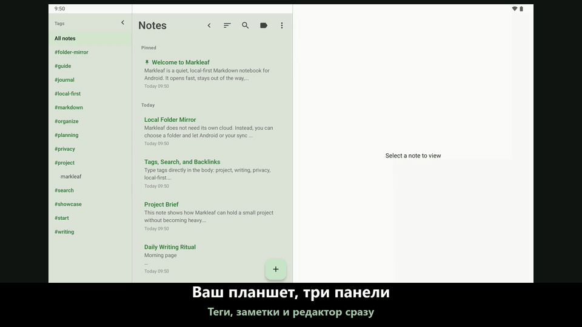

#  Markleaf

<p align="center">
  
</p>

<p align="center">
  <strong>Мысли, которые складываются легко, и аккуратные заметки в Markdown</strong><br />
  Минималистичное Android-приложение для заметок в Markdown, где всё хранится локально
</p>

<p align="center">
  <a href="https://trendshift.io/repositories/58116?utm_source=trendshift-badge&utm_medium=badge&utm_campaign=badge-trendshift-58116"></a>
</p>

<p align="center">
  
  
  
  
  
  
</p>

<p align="center">
  <a href="README.md">English</a> ·
  <a href="README.ko.md">한국어</a> ·
  <a href="README.ja.md">日本語</a> ·
  <a href="README.zh.md">简体中文</a> ·
  <a href="README.de.md">Deutsch</a> ·
  <a href="README.es.md">Español</a> ·
  <a href="README.fr.md">Français</a> ·
  <a href="README.hr.md">Hrvatski</a> ·
  <strong>Русский</strong> ·
  <a href="README.vi.md">Tiếng Việt</a>
</p>

<p align="center">
  <a href="https://github.com/jeiel85/markleaf-android">Репозиторий на GitHub</a> ·
  <a href="https://github.com/jeiel85/markleaf-android/discussions">Discussions (обратная связь)</a> ·
  <a href="https://gitlab.com/jeiel85/markleaf-android">Зеркало на GitLab (архив)</a>
</p>

<p align="center">
  
</p>

<p align="center">
  <sub><code>/</code> быстрая вставка → обычный Markdown → живой предпросмотр</sub>
</p>

<p align="center">
  
</p>

<p align="center">
  <sub>Три панели на планшете — панель тегов · список заметок · редактор на одном экране</sub>
</p>

---

## 🍃 Что такое Markleaf?

**Markleaf** — это Android-приложение для заметок в Markdown, из которого убрано всё лишнее, чтобы вы могли сосредоточиться всего на двух вещах: записывать и упорядочивать. Данные хранятся только на вашем устройстве, а стандартный Markdown гарантирует, что они полностью принадлежат вам и легко переносятся. Даже синхронизация идёт только через *выбранную вами папку* — сам Markleaf ничего не синхронизирует и никуда не выгружает.

[**Открыть страницу проекта**](https://jeiel85.github.io/markleaf-android/) · [Текущая версия: v2.51.0](https://github.com/jeiel85/markleaf-android/releases/tag/v2.51.0) · [Политика конфиденциальности](https://jeiel85.github.io/markleaf-android/privacy.html) · [F-Droid](https://f-droid.org/packages/com.markleaf.notes/) · [Google Play](https://play.google.com/store/apps/details?id=com.markleaf.notes)

---

## ✨ Основные возможности

### Письмо и предпросмотр
- **Быстрая вставка через `/`** — ищите команды в начале строки, чтобы вставлять заголовки, списки, таблицы, выноски, вики-ссылки, изображения и многое другое в виде стандартного Markdown
- **Живой предпросмотр Markdown** — мгновенно переключайтесь между редактированием и предпросмотром или включите опцию *Показывать синтаксис Markdown* для подсветки синтаксиса прямо при наборе
- **Таблицы GFM / флажки / цитаты / выноски (`> [!NOTE]` …)** — всё отображается в предпросмотре
- **Подсветка синтаксиса в блоках кода** — раскраска токенов для 10 языков: Kotlin, Java, Python, JavaScript/TypeScript, Bash, JSON, YAML, XML, SQL
- **Переход между ссылкой на сноску (`[^N]`) и её определением** — нажмите на верхний индекс, чтобы плавно прокрутить к определению
- **Вложенные изображения и редактирование alt-текста** — хранятся как изолированные копии во внутреннем хранилище приложения (разрешение на доступ к медиафайлам не нужно)
- **Умное переключение форматирования Markdown** — оборачивайте выделение или слово под курсором в жирный/курсив/зачёркнутый/встроенный код, а повторное нажатие аккуратно снимает уже применённое форматирование
- **Сочетания клавиш** — Ctrl/Cmd+B, I, K, Shift+S для жирного, курсива, ссылки и зачёркивания на аппаратной клавиатуре
- **Оглавление (TOC)** — в режиме предпросмотра переходите к заголовкам H1–H3, чтобы ориентироваться в длинных заметках
- **Выбор шрифта: с засечками / без засечек** — переключите область письма на шрифт с засечками для ощущения книги; блоки кода всегда остаются моноширинными
- **Режим фокуса / статистика слов, символов и времени чтения / поиск и замена внутри заметки**

### Упорядочивание и навигация
- **Классификация по тегам и автодополнение** — просто пишите `#теги` в тексте, и они проиндексируются автоматически, без папок; существующие теги подсказываются, как только вы вводите `#`
- **Вики-ссылки (`[[Title]]`) и панель обратных ссылок** — автодополнение и наглядный список того, что ссылается на эту заметку
- **Быстрый переход (Ctrl+K)** — переход по части заголовка в стиле Obsidian
- **Полнотекстовый поиск SQLite FTS** — быстрый, вплоть до текста заметок
- **Закрепление / архив / корзина** — перед окончательным удалением корзина ещё раз спрашивает подтверждение

### Синхронизация и экспорт (принцип No-Cloud)
- **Синхронизация через зеркало папки** — каждая заметка зеркалируется в файл `.md` / `.txt`, **названный по заголовку**, в папку, выбранную через SAF (Drive/Dropbox/Syncthing/OneDrive/NAS и т. д.); если переименовать заметку, файл переименуется вслед за ней. Сам Markleaf ничего не синхронизирует — это поручается *внешнему приложению, которое синхронизирует эту папку*
- **Открытие файла `.md` / `.txt` для чтения** — пункт *Открыть файл…* в меню ⋮ или нажатие в файловом менеджере открывает файл с форматированием и только для чтения; в ваши заметки ничего не попадёт, пока вы не нажмёте *Сохранить как заметку* (если заголовка нет, заголовком станет имя файла). Файл, которым поделились в Markleaf из другого приложения, по-прежнему импортируется сразу. Теги в заметках, пришедших через синхронизацию, распознаются сразу же
- **Экспорт отдельных / всех заметок в `.md`**
- **Отправка через системное меню «Поделиться»**

### Дизайн и доступность
- **Зелёная тема Markleaf и переключатель Material You** — по желанию цвета из системных обоев Android 12+
- **Автоматическая тёмная тема** — следует системной настройке
- **Трёхпанельный макет на планшете** — боковая панель тегов · список заметок · редактор; нажмите на тег в боковой панели, чтобы отфильтровать список заметок на месте (список заметок по-прежнему можно свернуть)
- **Интерфейс на 10 языках** — ресурсы на корейском / английском / испанском / японском / французском / немецком / упрощённом китайском / хорватском / русском / вьетнамском
- **Опция блокировки скриншотов и превью в списке недавних приложений** — для конфиденциальных заметок

---

## 🔗 Работает с Markdown-папкой, которая у вас уже есть

У Markleaf нет собственного формата хранилища. Укажите ему папку — в том числе ту, которую уже открывают Obsidian, Logseq или ваш текстовый редактор, — и он будет работать с лежащими в ней файлами.

- **Обычные файлы, которые и так ваши.** Одна заметка — один файл `.md` (или `.txt`). Положите существующие файлы в папку, и Markleaf подхватит их как заметки, когда в следующий раз окажется на переднем плане, — без отдельного импорта.
- **Ваш frontmatter сохраняется.** Markleaf добавляет небольшой YAML-заголовок (`markleaf_id`, отметки времени, закреплено/в архиве), чтобы сопоставлять файл с заметкой на разных устройствах, а **всё, что он не распознаёт, записывается обратно байт в байт** — включая блочные списки с отступами, в которых Obsidian пишет теги, вложенные словари, комментарии и кавычки. Добавляемый заголовок — строгое подмножество YAML, которое разбирают и Obsidian, и GitHub, и VS Code.
- **Тот же синтаксис, которым вы уже пишете.** `[[Вики-ссылки]]` с панелью обратных ссылок, встроенные `#теги`, таблицы и флажки GFM, выноски `> [!NOTE]` и быстрый переход `Ctrl+K` в стиле Obsidian.
- **Сверяется сам и осторожно.** Изменения, сделанные в другом месте, подтягиваются, когда Markleaf возвращается на передний план (не чаще раза в минуту). Правка из другого редактора будет замечена, даже если тот редактор вообще не трогает frontmatter Markleaf, — при сверке сравнивается текст, а не только отметка времени. Файл побеждает, только если он действительно новее; если изменились обе стороны, удалённая версия появляется как *отдельная* заметка, а не перезаписывает ваши правки, и ничего никогда не удаляется автоматически.

> [!IMPORTANT]
> **Две вещи, которые стоит знать, прежде чем направлять Markleaf на настоящее хранилище.**
> - **Одна папка, без подпапок.** Markleaf читает файлы, лежащие непосредственно в выбранной папке, и не заходит в подкаталоги. Хранилище, разложенное по вложенным папкам, будет видно Markleaf только на верхнем уровне — это сделано намеренно: Markleaf упорядочивает заметки тегами, а не папками.
> - **Правка заметки переименовывает её файл.** Имена файлов зеркала следуют за заголовком заметки, поэтому файл, чьё имя отличается от его заголовка, будет переименован при первом сохранении в Markleaf. Если `[[ссылки]]` в вашем хранилище указывают на старое имя файла, они сломаются.
>
> Если в вашем хранилище много вложенных папок или ссылок, укажите Markleaf *отдельную* папку и используйте её как мобильный «входящий» ящик, из которого вы переносите заметки, а не как второй редактор самого хранилища.

---

## 🛠 Технологический стек

Markleaf следует современным стандартам Android-разработки и использует современный, удобный в сопровождении стек.

- **UI**: [Jetpack Compose](https://developer.android.com/jetpack/compose) + Material 3 + динамические цвета Material You
- **Архитектура**: простое разделение на слои (core / data / domain / feature / ui) + паттерн Repository
- **База данных**: [Room](https://developer.android.com/training/data-storage/room) — локальное хранение на основе SQLite, виртуальные таблицы FTS4 для полнотекстового поиска
- **Парсер Markdown**: [commonmark-java](https://github.com/commonmark/commonmark-java) (CommonMark 0.30 + расширения GFM: таблицы, зачёркивание, списки задач, сноски, YAML frontmatter; в предпросмотре одиночный перевод строки отображается как разрыв строки, а не как пробел)
- **Асинхронность**: [Kotlin Coroutines](https://kotlinlang.org/docs/coroutines-overview.html) и [Flow](https://kotlinlang.org/docs/flow.html)
- **Storage Access Framework (SAF)** — синхронизация через зеркало папки и вложенные изображения
- **Загрузка изображений**: [Coil](https://coil-kt.github.io/coil/) — подходящая для F-Droid, Apache 2.0
- **DataStore Preferences** — настройки приложения
- **Profile Installer 1.4.0 + Macrobenchmark** — измерение базового профиля холодного запуска (326 мс на TB320FC)
- **Тестирование**: JUnit + Robolectric + визуальные регрессионные тесты [Roborazzi](https://github.com/takahirom/roborazzi) (эталоны под Linux, порог 0.005)
- **CI**: GitHub Actions — сборка и инструментальные тесты являются обязательными проверками, а также launch-smoke, record-roborazzi и подписанный релиз по тегу

---

## 🏗 Архитектура

Для разделения ответственности и тестируемости Markleaf использует следующую слоистую структуру.

```text
com.markleaf.notes
├── core          # shared core logic: markdown processing, attachments, sync
├── data          # Room DB, entities, repository implementations (data source)
├── domain        # models, repository interfaces (business logic)
├── feature       # per-screen UI and ViewModels (presentation)
│   ├── editor    # editor, find/replace, wikilink autocomplete, callouts, tables
│   ├── notes     # note list, quick switcher, archive
│   ├── search    # FTS full-text search
│   ├── tags      # tag index
│   ├── trash     # trash / permanent delete
│   └── settings  # theme, sync folder, screenshot blocking, etc.
├── navigation    # Jetpack Compose Navigation setup
└── ui            # theme (Markleaf green / Material You), shared components
```

---

## 🚀 Начало работы

### Установка

> [!NOTE]
> **Обновления в Google Play сейчас приостановлены.** Новые версии не будут публиковаться в Play Store, пока не решится вопрос с требованием корейской регистрации бизнеса для разработчика-одиночки. Текущий релиз берите в **GitHub Releases**. F-Droid остаётся рекомендуемым способом обновления, когда его сборка догоняет актуальную версию. (Если приложение уже установлено из Play Store, оно продолжит работать.)

- **F-Droid** *(рекомендуется для автоматических обновлений)*: [Markleaf в F-Droid](https://f-droid.org/packages/com.markleaf.notes/) — найдите приложение в клиенте F-Droid или установите по ссылке выше. Каталог может обновляться позже GitHub; если текущая версия там ещё не появилась, воспользуйтесь GitHub Releases ниже. Используется тот же ключ подписи (SHA-256 `0be97352…f91a`), поэтому обновления продолжат приходить без проблем, даже если сначала вы установили APK с GitHub вручную.
- **Прямая установка APK**: в [релизе v2.51.0 на GitHub](https://github.com/jeiel85/markleaf-android/releases/tag/v2.51.0) два APK — `markleaf-v2.51.0.apk` совпадает со сборкой F-Droid/Play (без автообновления и без дополнительных разрешений), а `markleaf-v2.51.0-sideload.apk` добавляет включаемую по желанию проверку обновлений в приложении (`INTERNET`, `REQUEST_INSTALL_PACKAGES`). Для обновлений из приложения выберите sideload-версию, скачайте её и запустите на Android-устройстве — у обеих один и тот же ключ подписи, поэтому переход между ними позже будет обычным обновлением, а не переустановкой.
- **Google Play**: [Markleaf в Google Play](https://play.google.com/store/apps/details?id=com.markleaf.notes) — **обновления приостановлены** (см. примечание выше). Если приложение уже установлено, оно продолжит работать; текущую версию берите в GitHub Releases или в F-Droid, как только она там появится.

### Сборка из исходного кода
Если хотите собрать приложение или внести вклад, выполните следующие шаги.

```bash
# Клонировать репозиторий
git clone https://github.com/jeiel85/markleaf-android.git

# Перейти в папку проекта
cd markleaf-android

# Собрать и установить
./gradlew installDebug
```

Исправления ошибок в Markleaf чаще всего начинаются с чужого отчёта. Люди, которые их написали, перечислены в [THANKS.md](THANKS.md).

---

## 🔒 No-Cloud по замыслу

У Markleaf нет бэкенда, и ни одна ваша заметка никогда не покидает устройство сама по себе. Покинут ли ваши данные устройство — *решать только вам*.

- ✅ **Нет** `android.permission.INTERNET` в сборках для магазинов (F-Droid, Google Play) — они вообще не выполняют сетевых запросов
- ✅ **Нет** сервера / бэкенда Markleaf
- ✅ **Нет** аналитики / рекламы / отслеживания / SDK с закрытым кодом
- ✅ `android:allowBackup="false"` — данные Markleaf исключены из автоматического резервного копирования Android и переноса между устройствами
- ✅ Данные перемещаются только через механизмы ОС, когда *вы сами* экспортируете, делитесь, открываете внешнюю ссылку или выбираете папку SAF
- ✅ Полностью открытый исходный код под Apache 2.0, который может проверить любой

**Одно исключение, и только одно.** APK в [GitHub Releases](https://github.com/jeiel85/markleaf-android/releases/latest) объявляет `INTERNET` (для проверки обновлений, которая **включается по желанию и по умолчанию выключена**) и `REQUEST_INSTALL_PACKAGES` (чтобы установить обновление, которое вы сами решили скачать, после проверки его SHA-256). Сборки для F-Droid и Google Play не содержат ни этих разрешений, ни этого кода — они не отключены, их там просто нет. **Ни заметки, ни теги, ни вложения, ни метаданные, ни идентификаторы, ни данные об использовании никогда не отправляются — ни в одной сборке и ни одним из этих запросов.** Эта граница зафиксирована в [`docs/AGENT_SPEC.md` §15.9](docs/AGENT_SPEC.md).

Как именно устроено «никогда не покидает устройство», описано в [Политике конфиденциальности](docs/PRIVACY.md) и [Сертификации No-Cloud](docs/NOCLOUD_CERTIFICATION.md).

---

## 🗺 Дорожная карта

### v1.x — MVP
- [x] Базовое редактирование и сохранение Markdown
- [x] Фильтрация и поиск по тегам
- [x] Новая иконка приложения и брендинг
- [x] Живой предпросмотр Markdown и тёмная тема
- [x] Высокопроизводительный поиск SQLite FTS
- [x] Оптимизация двухпанельного макета для планшетов
- [x] Экспорт отдельной / всех заметок в Markdown
- [x] Стабильный релиз v1.0.0

### v2.x — расширение до уровня Bear (текущий этап)
- [x] **v2.3** Парсер CommonMark — выноски, зачёркивание GFM, списки задач, сноски, YAML frontmatter
- [x] **v2.4–2.5** Вики-ссылки (`[[Title]]`) + автодополнение + панель обратных ссылок
- [x] **v2.6** Вложенные изображения + alt-текст + лайтбокс
- [x] **v2.7** Синхронизация через зеркало папки SAF (делегирование Drive/Dropbox/Syncthing, по-прежнему без INTERNET)
- [x] **v2.8** Переключатель Material You + возвращение зелёной темы Markleaf
- [x] **v2.9** Опция блокировки скриншотов, внедрено визуальное регрессионное тестирование (Roborazzi)
- [x] **v2.10** Подсветка синтаксиса в блоках кода (10 языков)
- [x] **v2.11** Возвращён предпросмотр таблиц GFM
- [x] **v2.12** Быстрый переход (Ctrl+K)
- [x] **v2.13** Поиск / замена внутри заметки
- [x] **v2.14** Переход по нажатию между ссылкой на сноску и её определением
- [x] **v2.15** Стабилизация для публикации в F-Droid и документация No-Cloud
- [x] **v2.16** Виджет на главном экране, биометрическая блокировка, прозрачность открытого кода, умное форматирование Markdown
- [x] **v2.17** Импорт внешних файлов `.md`/`.txt` через «Открыть»/«Поделиться», исправления дублирования заметок и распознавания тегов при синхронизации папки
- [x] **v2.18** Файлы синхронизации папки называются по заголовку заметки (переименование следует за ним) + выбор `.md`/`.txt`
- [x] **v2.19** Шесть примеров заметок при первом запуске + экспорт в PDF/Markdown больше не дублирует заголовок
- [x] **v2.20** Сочетания клавиш, автодополнение `#тегов`, оглавление, шрифт с засечками, трёхпанельный макет для планшетов (боковая панель тегов + фильтрация на месте)
- [x] **v2.21** Предиктивный жест «назад», отполированные переходы, анимация списков/карточек, панель тегов для складных устройств и планшетов, переключение пунктов чек-листа
- [x] **v2.22** Команды быстрой вставки через `/` с выбором касанием и с аппаратной клавиатуры, меню на шести языках
- [x] **Публичный запуск в Google Play** — установить приложение из Play Store может любой

---

## 📜 Лицензия

Проект распространяется под лицензией **Apache License 2.0**. Подробности — в файле `LICENSE`.

---

<p align="center">
  Сделано с ❤️ командой <strong>Markleaf Team</strong>
</p>
