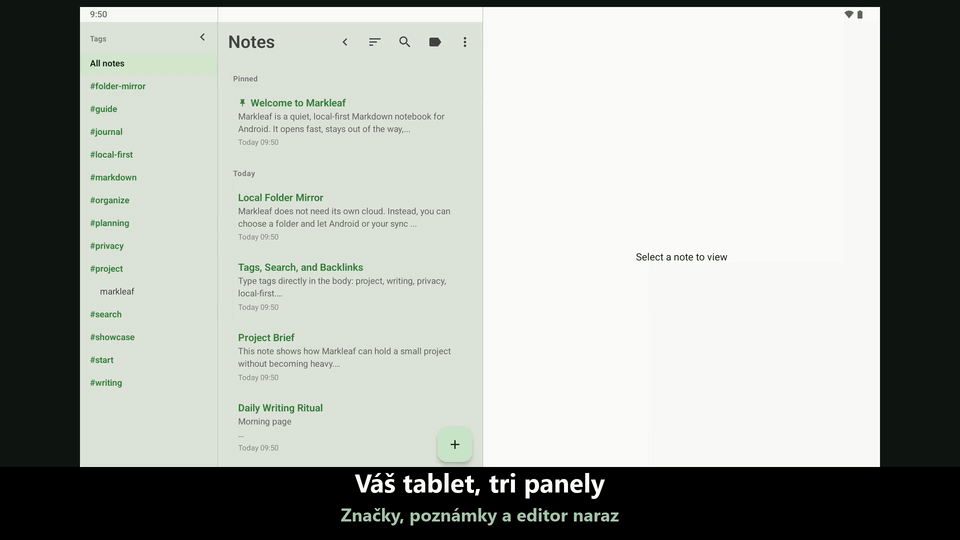

#  Markleaf

<p align="center">
  
</p>

<p align="center">
  <strong>Myšlienky, ktoré sa ukladajú ľahko, a úhľadné poznámky v Markdowne</strong><br />
  Minimalistická aplikácia na poznámky v Markdowne pre Android, ktorá uchováva všetko lokálne
</p>

<p align="center">
  <a href="https://trendshift.io/repositories/58116?utm_source=trendshift-badge&utm_medium=badge&utm_campaign=badge-trendshift-58116"></a>
</p>

<p align="center">
  
  
  
  
  
  
</p>

<p align="center">
  <a href="README.md">English</a> ·
  <a href="README.ko.md">한국어</a> ·
  <a href="README.ja.md">日本語</a> ·
  <a href="README.zh.md">简体中文</a> ·
  <a href="README.de.md">Deutsch</a> ·
  <a href="README.es.md">Español</a> ·
  <a href="README.fr.md">Français</a> ·
  <a href="README.hr.md">Hrvatski</a> ·
  <a href="README.ru.md">Русский</a> ·
  <a href="README.vi.md">Tiếng Việt</a> ·
  <strong>Slovenčina</strong>
</p>

<p align="center">
  <a href="https://github.com/jeiel85/markleaf-android">Repozitár na GitHube</a> ·
  <a href="https://github.com/jeiel85/markleaf-android/discussions">Discussions (spätná väzba)</a> ·
  <a href="https://gitlab.com/jeiel85/markleaf-android">Zrkadlo na GitLabe (archivované)</a>
</p>

<p align="center">
  
</p>

<p align="center">
  <sub><code>/</code> rýchle vloženie → obyčajný Markdown → živý náhľad</sub>
</p>

<p align="center">
  
</p>

<p align="center">
  <sub>Tri panely na tablete — panel značiek · zoznam poznámok · editor na jednej obrazovke</sub>
</p>

---

## 🍃 Čo je Markleaf?

**Markleaf** je aplikácia na poznámky v Markdowne pre Android, ktorá odstraňuje všetko zbytočné, aby ste sa mohli sústrediť len na dve veci: zapisovanie a usporiadanie. Vaše údaje sa ukladajú iba vo vašom zariadení a štandardný Markdown zaručuje, že vám plne patria a dajú sa ľahko preniesť. Aj synchronizácia prebieha výhradne cez *priečinok, ktorý si sami vyberiete* — Markleaf sám nič nesynchronizuje ani nikam neodosiela.

[**Zobraziť stránku projektu**](https://jeiel85.github.io/markleaf-android/index.sk.html) · [Aktuálna verzia: v2.53.2](https://github.com/jeiel85/markleaf-android/releases/tag/v2.53.2) · [Zásady ochrany osobných údajov](https://jeiel85.github.io/markleaf-android/privacy.sk.html) · [F-Droid](https://f-droid.org/packages/com.markleaf.notes/) · [Google Play](https://play.google.com/store/apps/details?id=com.markleaf.notes)

---

## ✨ Hlavné funkcie

### Písanie a náhľad
- **Rýchle vloženie cez `/`** — vyhľadajte príkaz na začiatku riadka a vložte nadpisy, zoznamy, tabuľky, zvýraznené bloky, wikiodkazy, obrázky a ďalšie prvky ako štandardný Markdown
- **Živý náhľad Markdownu** — okamžite prepínajte medzi úpravami a náhľadom alebo zapnite možnosť *Zobraziť syntax Markdownu* na zvýrazňovanie syntaxe priamo počas písania
- **Tabuľky GFM / začiarkavacie políčka / citáty / zvýraznené bloky (`> [!NOTE]` …)** — všetko sa vykreslí v náhľade
- **Zvýrazňovanie syntaxe v blokoch kódu** — farebné tokeny pre 10 jazykov: Kotlin, Java, Python, JavaScript/TypeScript, Bash, JSON, YAML, XML, SQL
- **Skok medzi odkazom na poznámku pod čiarou (`[^N]`) a jej definíciou** — ťuknutím na horný index plynulo prejdete k definícii
- **Obrázkové prílohy + úprava alternatívneho textu** — uchovávajú sa ako izolované kópie v internom úložisku aplikácie (bez povolenia na prístup k médiám)
- **Inteligentné prepínanie formátovania Markdownu** — obaľte výber alebo slovo pri kurzore do tučného písma/kurzívy/prečiarknutia/kódu v riadku a ďalším ťuknutím formátovanie čisto odstránite
- **Klávesové skratky** — Ctrl/Cmd+B, I, K, Shift+S pre tučné písmo, kurzívu, odkaz a prečiarknutie na hardvérovej klávesnici
- **Obsah (TOC)** — v režime náhľadu preskočte na nadpisy H1–H3 a ľahko sa zorientujte v dlhých poznámkach
- **Výber písma Serif / Sans** — prepnite plochu na písanie na pätkové písmo pre dojem knihy; bloky kódu vždy zostávajú s pevnou šírkou znakov
- **Režim čistého písania / štatistiky slov, znakov a času čítania / vyhľadávanie a nahrádzanie v poznámke**

### Usporiadanie a navigácia
- **Triedenie pomocou značiek + automatické dopĺňanie** — stačí písať `#značky` priamo do textu a automaticky sa zaindexujú, bez priečinkov; existujúce značky sa ponúkajú hneď, ako napíšete `#`
- **Wikiodkazy (`[[Názov]]`) + panel spätných odkazov** — automatické dopĺňanie a prehľad toho, čo odkazuje na túto poznámku
- **Rýchly prepínač (Ctrl+K)** — skok podľa časti názvu v štýle Obsidianu
- **Fulltextové vyhľadávanie SQLite FTS** — rýchle, až po samotný text poznámok
- **Pripnúť / archivovať / kôš** — pred trvalým odstránením sa kôš ešte raz opýta

### Synchronizácia a export (zásada No-Cloud)
- **Synchronizácia zrkadlením priečinka** — každú poznámku zrkadlí ako súbor `.md` / `.txt` **pomenovaný podľa názvu poznámky** do priečinka, ktorý vyberiete cez SAF (Drive/Dropbox/Syncthing/OneDrive/NAS a pod.); keď poznámku premenujete, súbor sa premenuje s ňou. Markleaf sám nič nesynchronizuje; túto úlohu prenecháva *akejkoľvek externej aplikácii, ktorá daný priečinok synchronizuje*
- **Otvorenie súboru `.md` / `.txt` na čítanie** — položka *Otvoriť súbor…* v ponuke ⋮ alebo ťuknutie v správcovi súborov otvorí súbor vykreslený a len na čítanie; medzi vaše poznámky sa nič nepridá, kým neťuknete na *Uložiť ako poznámku* (ak súbor nemá nadpis, názvom poznámky sa stane názov súboru). Súbor zdieľaný do Markleafu z inej aplikácie sa stále importuje okamžite. Značky v poznámkach prijatých synchronizáciou sa rozpoznajú hneď
- **Export jednotlivých / všetkých poznámok ako `.md`**
- **Odoslanie cez systémovú ponuku zdieľania**

### Dizajn a prístupnosť
- **Motív Markleaf green + prepínač Material You** — voliteľne farby systémovej tapety v Androide 12 a novšom
- **Automatický tmavý režim** — riadi sa nastavením systému
- **Rozloženie s tromi panelmi na tablete** — bočný panel značiek · zoznam poznámok · editor; ťuknutím na značku v bočnom paneli vyfiltrujete zoznam poznámok priamo na mieste (zoznam poznámok sa dá stále zbaliť)
- **Rozhranie v 11 jazykoch** — kórejčina / angličtina / španielčina / japončina / francúzština / nemčina / zjednodušená čínština / chorvátčina / ruština / vietnamčina / slovenčina
- **Možnosť zablokovať snímky obrazovky a náhľad nedávnych položiek** — pre citlivé poznámky

---

## 🔗 Funguje s priečinkom Markdownu, ktorý už máte

Markleaf nemá vlastný formát trezoru. Nasmerujte ho na priečinok — aj na taký, ktorý už otvára Obsidian, Logseq alebo váš textový editor — a bude pracovať so súbormi, ktoré v ňom sú.

- **Obyčajné súbory, ktoré už sú vaše.** Jedna poznámka je jeden súbor `.md` (alebo `.txt`). Vložte existujúce súbory do priečinka a Markleaf ich načíta ako poznámky, keď sa nabudúce dostane do popredia — bez akéhokoľvek importu.
- **Váš frontmatter zostane zachovaný.** Markleaf pridá malú hlavičku YAML (`markleaf_id`, časové pečiatky, pripnuté/archivované), aby vedel priradiť súbor k poznámke naprieč zariadeniami, a **všetko, čo nerozpozná, zapíše späť bajt po bajte** — vrátane odsadených blokových zoznamov, do ktorých Obsidian zapisuje značky, vnorených máp, komentárov a úvodzoviek. Pridaná hlavička je striktná podmnožina YAML, ktorú spracujú Obsidian, GitHub aj VS Code.
- **Rovnaká syntax, akú už píšete.** `[[Wikiodkazy]]` s panelom spätných odkazov, `#značky` priamo v texte, tabuľky a začiarkavacie políčka GFM, zvýraznené bloky `> [!NOTE]` a rýchly prepínač `Ctrl+K` v štýle Obsidianu.
- **Zosúlaďuje sa sám a opatrne.** Zmeny urobené inde sa načítajú, keď sa Markleaf vráti do popredia (najviac raz za minútu). Úpravu z iného editora zachytí, aj keď sa tento editor frontmatteru Markleafu vôbec nedotkne — pri zosúladení sa porovnáva text, nielen časová pečiatka. Súbor vyhrá, iba ak je naozaj novší; ak sa zmenili obe strany, vzdialená verzia pribudne ako *samostatná* poznámka namiesto toho, aby prepísala vaše úpravy, a nič sa nikdy neodstráni automaticky.

> [!IMPORTANT]
> **Dve veci, ktoré by ste mali vedieť predtým, ako Markleaf nasmerujete na skutočný trezor.**
> - **Jeden priečinok, bez podpriečinkov.** Markleaf číta súbory priamo vo vybranom priečinku a do podpriečinkov nevstupuje. Trezor rozdelený do vnorených priečinkov uvidí Markleaf len na jeho najvyššej úrovni — zámerne, pretože Markleaf usporadúva poznámky pomocou značiek, nie priečinkov.
> - **Úprava poznámky premenuje jej súbor.** Názvy zrkadlených súborov sa riadia názvom poznámky, takže súbor, ktorého názov sa líši od jeho nadpisu, sa pri prvom uložení v Markleafe premenuje. Ak `[[odkazy]]` vo vašom trezore smerujú na pôvodný názov súboru, prestanú fungovať.
>
> Ak máte trezor s mnohými vnorenými priečinkami alebo odkazmi, nasmerujte Markleaf na *samostatný* priečinok a používajte ho ako mobilnú schránku, z ktorej poznámky presúvate, nie ako druhý editor samotného trezoru.

---

## 🛠 Technológie

Markleaf dodržiava aktuálne štandardy vývoja pre Android a používa moderný, ľahko udržiavateľný súbor technológií.

- **Rozhranie**: [Jetpack Compose](https://developer.android.com/jetpack/compose) + Material 3 + dynamické farby Material You
- **Architektúra**: jednoduché rozdelenie do vrstiev (core / data / domain / feature / ui) + vzor Repository
- **Databáza**: [Room](https://developer.android.com/training/data-storage/room) — lokálne úložisko nad SQLite, virtuálne tabuľky FTS4 na fulltextové vyhľadávanie
- **Parser Markdownu**: [commonmark-java](https://github.com/commonmark/commonmark-java) (CommonMark 0.30 + rozšírenia GFM: tabuľky, prečiarknutie, zoznamy úloh, poznámky pod čiarou, YAML frontmatter; náhľad zobrazí jeden znak nového riadka ako zalomenie riadka, nie ako medzeru)
- **Asynchrónnosť**: [Kotlin Coroutines](https://kotlinlang.org/docs/coroutines-overview.html) a [Flow](https://kotlinlang.org/docs/flow.html)
- **Storage Access Framework (SAF)** — synchronizácia zrkadlením priečinka + obrázkové prílohy
- **Načítavanie obrázkov**: [Coil](https://coil-kt.github.io/coil/) — Apache 2.0, vhodné pre F-Droid
- **DataStore Preferences** — nastavenia aplikácie
- **Profile Installer 1.4.0 + Macrobenchmark** — meranie baseline profilu pri studenom štarte (326 ms na TB320FC)
- **Testovanie**: JUnit + Robolectric + vizuálne regresné testy [Roborazzi](https://github.com/takahirom/roborazzi) (referenčné snímky z Linuxu, prah 0,005)
- **CI**: GitHub Actions — build a inštrumentované testy sú povinné kontroly, k tomu launch-smoke, record-roborazzi a podpísané vydanie pri značke (tagu)

---

## 🏗 Architektúra

Markleaf používa nasledujúcu vrstvenú štruktúru, ktorá oddeľuje zodpovednosti a uľahčuje testovanie.

```text
com.markleaf.notes
├── core          # spoločné jadro: spracovanie markdownu, prílohy, synchronizácia
├── data          # Room DB, entity, implementácie repozitárov (zdroj údajov)
├── domain        # modely, rozhrania repozitárov (biznis logika)
├── feature       # UI a ViewModely jednotlivých obrazoviek (prezentácia)
│   ├── editor    # editor, vyhľadávanie/nahrádzanie, dopĺňanie wikiodkazov, zvýraznené bloky, tabuľky
│   ├── notes     # zoznam poznámok, rýchly prepínač, archív
│   ├── search    # fulltextové vyhľadávanie FTS
│   ├── tags      # index značiek
│   ├── trash     # kôš / trvalé odstránenie
│   └── settings  # motív, synchronizačný priečinok, blokovanie snímok obrazovky atď.
├── navigation    # nastavenie Jetpack Compose Navigation
└── ui            # motív (Markleaf green / Material You), spoločné komponenty
```

---

## 🚀 Začíname

### Inštalácia

> [!NOTE]
> **Aktualizácie v Google Play sú momentálne pozastavené.** Nové verzie sa do Obchodu Play nedostanú, kým sa nevyrieši požiadavka kórejských predpisov na registráciu podnikania samostatného vývojára. Aktuálne vydanie nájdete v **GitHub Releases**. F-Droid zostáva odporúčaným spôsobom aktualizácií, keď jeho build dobehne aktuálnu verziu. (Ak ste aplikáciu už nainštalovali z Obchodu Play, bude naďalej fungovať.)

- **F-Droid** *(odporúča sa pre automatické aktualizácie)*: [Markleaf na F-Droide](https://f-droid.org/packages/com.markleaf.notes/) — vyhľadajte aplikáciu v klientovi F-Droid alebo ju nainštalujte cez odkaz vyššie. Katalóg sa môže aktualizovať neskôr ako GitHub; ak v ňom ešte nie je aktuálna verzia, použite GitHub Releases nižšie. Používa rovnaký podpisový kľúč (SHA-256 `0be97352…f91a`), takže aktualizácie budú plynule pokračovať, aj keď ste najprv ručne nainštalovali APK z GitHubu.
- **Priama inštalácia APK**: [vydanie v2.53.2 na GitHube](https://github.com/jeiel85/markleaf-android/releases/tag/v2.53.2) obsahuje dva súbory APK — `markleaf-v2.53.2.apk` zodpovedá buildu z F-Droidu/Play (bez automatických aktualizácií, bez ďalších povolení) a `markleaf-v2.53.2-sideload.apk` pridáva voliteľnú kontrolu aktualizácií v aplikácii (`INTERNET`, `REQUEST_INSTALL_PACKAGES`). Ak chcete aktualizácie priamo v aplikácii, vyberte verziu sideload, stiahnite ju a spustite v zariadení s Androidom — obe majú rovnaký podpisový kľúč, takže neskorší prechod medzi nimi je bežná aktualizácia, nie preinštalovanie.
- **Google Play**: [Markleaf v Google Play](https://play.google.com/store/apps/details?id=com.markleaf.notes) — **aktualizácie sú pozastavené** (pozri poznámku vyššie). Ak aplikáciu už máte, bude naďalej fungovať; aktuálnu verziu získate v GitHub Releases alebo na F-Droide, keď tam bude dostupná.

### Zostavenie zo zdrojového kódu
Ak chcete aplikáciu zostaviť alebo prispieť, postupujte podľa týchto krokov.

```bash
# Naklonujte repozitár
git clone https://github.com/jeiel85/markleaf-android.git

# Prejdite do priečinka projektu
cd markleaf-android

# Zostavte a nainštalujte
./gradlew installDebug
```

Opravy chýb v Markleafe sa väčšinou začínajú hlásením od niekoho iného. Ľudia, ktorí ich napísali, sú uvedení v súbore [THANKS.md](THANKS.md).

---

## 🔒 No-Cloud už v návrhu

Markleaf nemá žiadny backend a žiadna z vašich poznámok nikdy sama neopustí zariadenie. Či vaše údaje zariadenie opustia, je *výlučne na vás*.

- ✅ **Žiadne** `android.permission.INTERNET` v buildoch pre obchody (F-Droid, Google Play) — nevykonávajú vôbec žiadne sieťové požiadavky
- ✅ **Žiadny** server / backend Markleafu
- ✅ **Žiadna** analytika / reklamy / sledovanie / SDK s uzavretým zdrojovým kódom
- ✅ `android:allowBackup="false"` — údaje Markleafu sú vylúčené z automatického zálohovania Androidu a z prenosu do iného zariadenia
- ✅ Údaje sa presúvajú len cez mechanizmy operačného systému, keď *vy sami* exportujete, zdieľate, otvoríte externý odkaz alebo vyberiete priečinok SAF
- ✅ Úplne otvorený zdrojový kód pod licenciou Apache 2.0, ktorý môže ktokoľvek skontrolovať

**Jedna výnimka, a iba jedna.** APK v [GitHub Releases](https://github.com/jeiel85/markleaf-android/releases/latest) deklaruje `INTERNET` (pre kontrolu aktualizácií, ktorá je **voliteľná a predvolene vypnutá**) a `REQUEST_INSTALL_PACKAGES` (aby mohla nainštalovať aktualizáciu, ktorú sa sami rozhodnete stiahnuť, po overení jej SHA-256). Buildy pre F-Droid a Google Play neobsahujú ani tieto povolenia, ani príslušný kód — nie sú vypnuté, vôbec v nich nie sú. **Poznámky, značky, prílohy, metadáta, identifikátory ani údaje o používaní sa nikdy neodosielajú — v žiadnom builde ani žiadnou z týchto požiadaviek.** Táto hranica je zapísaná v [`docs/AGENT_SPEC.md` §15.9](docs/AGENT_SPEC.md).

Ako presne funguje „nikdy neopustí vaše zariadenie“, je opísané v [Zásadách ochrany osobných údajov](docs/PRIVACY.md) a v [certifikácii No-Cloud](docs/NOCLOUD_CERTIFICATION.md).

---

## 🗺 Plán vývoja

### v1.x — MVP
- [x] Základné úpravy a ukladanie Markdownu
- [x] Filtrovanie a vyhľadávanie podľa značiek
- [x] Nová ikona aplikácie a vizuálna identita
- [x] Živý náhľad Markdownu a tmavý režim
- [x] Vysokovýkonné vyhľadávanie SQLite FTS
- [x] Optimalizácia rozloženia s dvoma panelmi pre tablety
- [x] Export jednej / všetkých poznámok do Markdownu
- [x] Stabilné vydanie v1.0.0

### v2.x — rozšírenie na úroveň Bearu (aktuálne)
- [x] **v2.3** Parser CommonMark — zvýraznené bloky, prečiarknutie GFM, zoznamy úloh, poznámky pod čiarou, YAML frontmatter
- [x] **v2.4–2.5** Wikiodkazy (`[[Názov]]`) + automatické dopĺňanie + panel spätných odkazov
- [x] **v2.6** Obrázkové prílohy + alternatívny text + lightbox
- [x] **v2.7** Synchronizácia zrkadlením priečinka cez SAF (prenechaná Drive/Dropboxu/Syncthingu, stále bez INTERNET)
- [x] **v2.8** Prepínač Material You + návrat motívu Markleaf green
- [x] **v2.9** Možnosť blokovania snímok obrazovky, zavedené vizuálne regresné testovanie (Roborazzi)
- [x] **v2.10** Zvýrazňovanie syntaxe v blokoch kódu (10 jazykov)
- [x] **v2.11** Obnovený náhľad tabuliek GFM
- [x] **v2.12** Rýchly prepínač (Ctrl+K)
- [x] **v2.13** Vyhľadávanie / nahrádzanie v poznámke
- [x] **v2.14** Skok ťuknutím medzi odkazom na poznámku pod čiarou a jej definíciou
- [x] **v2.15** Stabilizácia pre zaradenie do F-Droidu a dokumentácia No-Cloud
- [x] **v2.16** Widget na domovskej obrazovke, biometrické uzamknutie, transparentnosť otvoreného kódu, inteligentné formátovanie Markdownu
- [x] **v2.17** Import externých súborov `.md`/`.txt` otvorením/zdieľaním, opravy duplicitných poznámok a rozpoznávania značiek pri synchronizácii priečinka
- [x] **v2.18** Súbory synchronizovaného priečinka pomenované podľa názvu poznámky (premenovanie sa prenesie) + výber `.md`/`.txt`
- [x] **v2.19** Šesť ukážkových poznámok pri prvom spustení + export do PDF/Markdownu už neduplikuje názov
- [x] **v2.20** Klávesové skratky, dopĺňanie `#značiek`, obsah, pätkové písmo, rozloženie s tromi panelmi pre tablety (bočný panel značiek + filtrovanie na mieste)
- [x] **v2.21** Prediktívne gesto späť, vyladené prechody, animácie zoznamu/kariet, panel značiek pre skladacie tablety, prepínanie položiek zoznamu úloh
- [x] **v2.22** Príkazy rýchleho vloženia cez `/` s výberom dotykom aj hardvérovou klávesnicou a šiestimi lokalizovanými ponukami
- [x] **Verejné spustenie v Google Play** — aplikáciu si môže z Obchodu Play nainštalovať ktokoľvek

---

## 📜 Licencia

Tento projekt je licencovaný pod **Apache License 2.0**. Podrobnosti nájdete v súbore `LICENSE`.

---

<p align="center">
  Vytvorené s ❤️ tímom <strong>Markleaf Team</strong>
</p>
