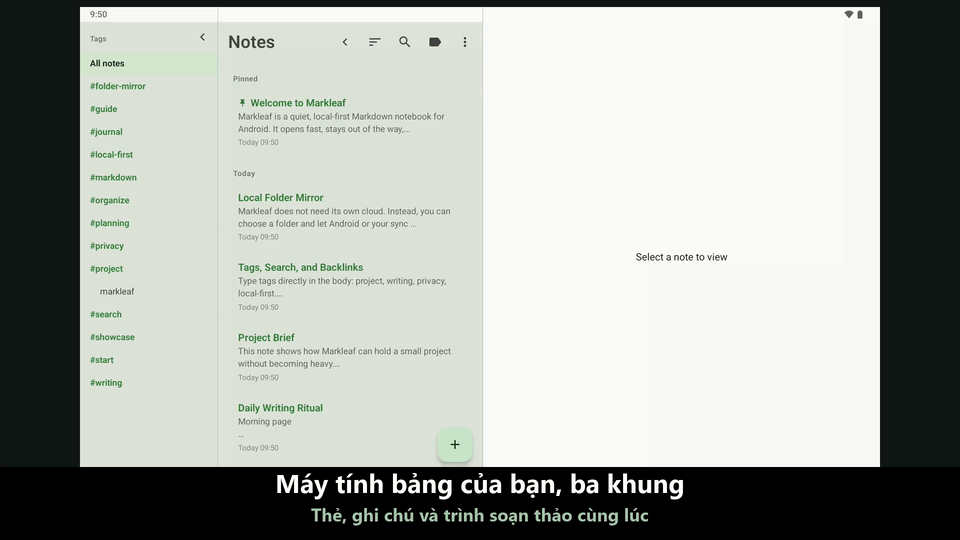

#  Markleaf

<p align="center">
  
</p>

<p align="center">
  <strong>Suy nghĩ nhẹ nhàng tích lũy, ghi chú Markdown gọn gàng</strong><br />
  Ứng dụng ghi chú Markdown tối giản, ưu tiên lưu trữ cục bộ cho Android
</p>

<p align="center">
  <a href="https://trendshift.io/repositories/58116?utm_source=trendshift-badge&utm_medium=badge&utm_campaign=badge-trendshift-58116"></a>
</p>

<p align="center">
  
  
  
  
  
  
</p>

<p align="center">
  <a href="README.md">English</a> ·
  <a href="README.ko.md">한국어</a> ·
  <a href="README.ja.md">日本語</a> ·
  <a href="README.zh.md">简体中文</a> ·
  <a href="README.de.md">Deutsch</a> ·
  <a href="README.es.md">Español</a> ·
  <a href="README.fr.md">Français</a> ·
  <a href="README.hr.md">Hrvatski</a> ·
  <a href="README.ru.md">Русский</a> ·
  <strong>Tiếng Việt</strong>
</p>

<p align="center">
  <a href="https://github.com/jeiel85/markleaf-android">Kho mã GitHub</a> ·
  <a href="https://github.com/jeiel85/markleaf-android/discussions">Discussions (góp ý)</a> ·
  <a href="https://gitlab.com/jeiel85/markleaf-android">Bản sao GitLab (đã lưu trữ)</a>
</p>

<p align="center">
  
</p>

<p align="center">
  <sub><code>/</code> chèn nhanh → Markdown thuần → xem trước trực tiếp</sub>
</p>

<p align="center">
  
</p>

<p align="center">
  <sub>Bố cục 3 khung trên máy tính bảng — thanh thẻ · danh sách ghi chú · trình soạn thảo trên một màn hình</sub>
</p>

---

## 🍃 Markleaf là gì?

**Markleaf** là ứng dụng ghi chú Markdown cho Android, được thiết kế để loại bỏ mọi thứ rườm rà, giúp bạn chỉ tập trung vào hai việc: ghi lại và sắp xếp. Dữ liệu chỉ được lưu trên thiết bị của bạn, và Markdown chuẩn bảo đảm bạn hoàn toàn sở hữu cũng như dễ dàng mang dữ liệu đi bất cứ đâu. Ngay cả đồng bộ cũng chỉ diễn ra qua *thư mục do bạn chọn* — bản thân Markleaf không bao giờ đồng bộ hay tải lên bất cứ thứ gì.

[**Xem trang giới thiệu**](https://jeiel85.github.io/markleaf-android/) · [Phiên bản hiện tại: v2.46.1](https://github.com/jeiel85/markleaf-android/releases/tag/v2.46.1) · [Chính sách quyền riêng tư](https://jeiel85.github.io/markleaf-android/privacy.html) · [F-Droid](https://f-droid.org/packages/com.markleaf.notes/) · [Google Play](https://play.google.com/store/apps/details?id=com.markleaf.notes)

---

## ✨ Tính năng chính

### Soạn thảo & xem trước
- **Chèn nhanh bằng `/`** — tìm lệnh ở đầu dòng để chèn tiêu đề, danh sách, bảng, khung chú thích, wikilink, hình ảnh và nhiều hơn nữa dưới dạng Markdown chuẩn
- **Xem trước Markdown trực tiếp** — chuyển tức thì giữa chế độ soạn thảo và xem trước, hoặc dùng tùy chọn *Hiện cú pháp Markdown* để tô màu cú pháp ngay khi gõ
- **Bảng GFM / hộp kiểm / trích dẫn / khung chú thích (`> [!NOTE]` …)** — tất cả đều hiển thị trong bản xem trước
- **Tô sáng cú pháp trong khối mã** — tô màu token cho 10 ngôn ngữ: Kotlin, Java, Python, JavaScript/TypeScript, Bash, JSON, YAML, XML, SQL
- **Nhảy giữa tham chiếu ↔ định nghĩa chú thích cuối trang (`[^N]`)** — chạm vào chỉ số trên để cuộn mượt đến phần định nghĩa
- **Đính kèm hình ảnh + chỉnh sửa văn bản thay thế** — được lưu thành bản sao riêng trong bộ nhớ trong của ứng dụng (không cần quyền truy cập phương tiện)
- **Bật/tắt định dạng Markdown thông minh** — bọc vùng chọn hoặc từ quanh con trỏ bằng Đậm/Nghiêng/Gạch ngang/Mã nội dòng, chạm lần nữa để gỡ gọn gàng phần đã được bọc
- **Phím tắt** — Ctrl/Cmd+B, I, K, Shift+S cho chữ đậm, nghiêng, liên kết và gạch ngang trên bàn phím vật lý
- **Mục lục (TOC)** — trong chế độ xem trước, nhảy đến các tiêu đề H1–H3 để di chuyển trong ghi chú dài
- **Chọn phông Serif / Sans** — chuyển vùng soạn thảo sang phông có chân để có cảm giác như đọc sách; khối mã luôn giữ phông đơn cách
- **Chế độ tập trung / thống kê số từ, ký tự & thời gian đọc / tìm & thay thế trong ghi chú**

### Sắp xếp & điều hướng
- **Phân loại bằng thẻ + tự động hoàn thành** — chỉ cần viết `#thẻ` trong nội dung để được lập chỉ mục tự động, không cần thư mục; các thẻ có sẵn sẽ được gợi ý khi bạn gõ `#`
- **Wikilink (`[[Tiêu đề]]`) + bảng liên kết ngược** — tự động hoàn thành, và thấy ngay những gì đang trỏ đến ghi chú này
- **Chuyển nhanh (Ctrl+K)** — nhảy theo chuỗi con trong tiêu đề, kiểu Obsidian
- **Tìm kiếm toàn văn SQLite FTS** — nhanh, tìm đến tận nội dung
- **Ghim / lưu trữ / thùng rác** — thùng rác hỏi lại một lần trước khi xóa vĩnh viễn

### Đồng bộ & xuất (nguyên tắc không đám mây)
- **Đồng bộ phản chiếu thư mục** — phản chiếu mỗi ghi chú thành một tệp `.md` / `.txt` **đặt tên theo tiêu đề** vào thư mục bạn chọn qua SAF (Drive/Dropbox/Syncthing/OneDrive/NAS, v.v.); đổi tên ghi chú thì tên tệp cũng đổi theo. Bản thân Markleaf không bao giờ tự đồng bộ; việc đó được giao cho *bất kỳ ứng dụng bên ngoài nào đồng bộ thư mục đó*
- **Mở tệp `.md` / `.txt` để đọc** — *Mở tệp…* trong menu ⋮, hoặc chạm vào tệp trong trình quản lý tệp, sẽ mở tệp ở dạng đã hiển thị và chỉ đọc; tệp chỉ được thêm vào ghi chú khi bạn chạm *Lưu thành ghi chú* (tên tệp trở thành tiêu đề nếu không có tiêu đề). Chia sẻ tệp vào Markleaf từ ứng dụng khác vẫn nhập ngay lập tức. Thẻ trong các ghi chú được đồng bộ vào sẽ được nhận diện ngay
- **Xuất từng ghi chú / tất cả ghi chú dưới dạng `.md`**
- **Gửi qua bảng chia sẻ của hệ thống**

### Thiết kế & trợ năng
- **Giao diện xanh Markleaf + bật/tắt Material You** — tùy chọn dùng màu hình nền hệ thống trên Android 12+
- **Chế độ tối tự động** — theo cài đặt hệ thống
- **Bố cục 3 khung cho máy tính bảng** — thanh thẻ bên · danh sách ghi chú · trình soạn thảo; chạm vào thẻ ở thanh bên để lọc danh sách ghi chú ngay tại chỗ (danh sách ghi chú vẫn thu gọn được)
- **Giao diện bằng 10 ngôn ngữ** — tài nguyên tiếng Hàn / tiếng Anh / tiếng Tây Ban Nha / tiếng Nhật / tiếng Pháp / tiếng Đức / tiếng Trung giản thể / tiếng Croatia / tiếng Nga / tiếng Việt
- **Tùy chọn chặn chụp màn hình / xem trước trong ứng dụng gần đây** — dành cho ghi chú nhạy cảm

---

## 🔗 Làm việc với thư mục Markdown bạn đã có

Markleaf không có định dạng vault riêng. Hãy trỏ nó đến một thư mục — kể cả thư mục mà Obsidian, Logseq hay trình soạn thảo văn bản của bạn đang mở — và nó sẽ làm việc với chính các tệp ở đó.

- **Tệp thuần, vốn là của bạn.** Mỗi ghi chú là một tệp `.md` (hoặc `.txt`). Thả các tệp có sẵn vào thư mục và Markleaf sẽ nhận chúng thành ghi chú trong lần tiếp theo ứng dụng trở lại tiền cảnh — không cần bước nhập.
- **Frontmatter của bạn được giữ nguyên.** Markleaf thêm một phần đầu YAML nhỏ (`markleaf_id`, dấu thời gian, trạng thái ghim/lưu trữ) để khớp tệp với ghi chú trên nhiều thiết bị, và **mọi thứ nó không nhận ra đều được ghi trả lại nguyên vẹn từng byte** — bao gồm cả danh sách khối thụt lề mà Obsidian dùng để ghi thẻ, ánh xạ lồng nhau, chú thích và dấu ngoặc kép. Phần đầu mà nó thêm vào là một tập con chặt chẽ của YAML mà Obsidian, GitHub và VS Code đều phân tích được.
- **Cú pháp bạn vẫn đang viết.** `[[Wikilink]]` kèm bảng liên kết ngược, `#thẻ` nội dòng, bảng và hộp kiểm GFM, khung chú thích `> [!NOTE]`, cùng trình chuyển nhanh `Ctrl+K` kiểu Obsidian.
- **Tự đối chiếu, một cách cẩn trọng.** Các thay đổi thực hiện ở nơi khác được kéo vào khi Markleaf trở lại tiền cảnh (tối đa một lần mỗi phút). Chỉnh sửa từ trình soạn thảo khác vẫn được nhận ra ngay cả khi trình đó không hề động đến frontmatter của Markleaf — quá trình đối chiếu so sánh nội dung chứ không chỉ dấu thời gian. Tệp chỉ thắng khi nó thực sự mới hơn; nếu cả hai phía đều thay đổi, bản từ xa sẽ xuất hiện như một ghi chú *riêng biệt* thay vì ghi đè lên chỉnh sửa của bạn, và không có gì bị xóa tự động.

> [!IMPORTANT]
> **Hai điều cần biết trước khi trỏ Markleaf đến một vault thật.**
> - **Một thư mục, không có thư mục con.** Markleaf đọc các tệp nằm trực tiếp trong thư mục bạn chọn và không đi vào thư mục con. Một vault được tổ chức theo thư mục lồng nhau sẽ chỉ được Markleaf thấy ở cấp trên cùng — đây là chủ ý thiết kế, vì Markleaf sắp xếp bằng thẻ thay vì thư mục.
> - **Chỉnh sửa ghi chú sẽ đổi tên tệp của nó.** Tên tệp phản chiếu đi theo tiêu đề ghi chú, nên một tệp có tên khác với tiêu đề sẽ bị đổi tên ở lần đầu bạn lưu nó trong Markleaf. Những `[[liên kết]]` trong vault trỏ đến tên tệp cũ sẽ bị hỏng.
>
> Nếu vault của bạn có nhiều tầng thư mục hoặc dùng nhiều liên kết, hãy trỏ Markleaf đến một thư mục *riêng* và xem nó như hộp thư đến trên di động để bạn gộp lại sau, thay vì dùng nó như trình soạn thảo thứ hai cho chính vault đó.

---

## 🛠 Công nghệ sử dụng

Markleaf tuân theo các chuẩn phát triển Android hiện hành với bộ công nghệ hiện đại, dễ bảo trì.

- **Giao diện**: [Jetpack Compose](https://developer.android.com/jetpack/compose) + Material 3 + màu động Material You
- **Kiến trúc**: phân lớp đơn giản (core / data / domain / feature / ui) + mẫu Repository
- **Cơ sở dữ liệu**: [Room](https://developer.android.com/training/data-storage/room) — lưu trữ cục bộ dựa trên SQLite, bảng ảo FTS4 cho tìm kiếm toàn văn
- **Trình phân tích Markdown**: [commonmark-java](https://github.com/commonmark/commonmark-java) (CommonMark 0.30 + phần mở rộng GFM: bảng, gạch ngang, danh sách việc cần làm, chú thích cuối trang, YAML frontmatter; bản xem trước hiển thị một lần xuống dòng là ngắt dòng thay vì dấu cách)
- **Bất đồng bộ**: [Kotlin Coroutines](https://kotlinlang.org/docs/coroutines-overview.html) & [Flow](https://kotlinlang.org/docs/flow.html)
- **Storage Access Framework (SAF)** — đồng bộ phản chiếu thư mục + đính kèm hình ảnh
- **Tải hình ảnh**: [Coil](https://coil-kt.github.io/coil/) — Apache 2.0, thân thiện với F-Droid
- **DataStore Preferences** — cài đặt ứng dụng
- **Profile Installer 1.4.0 + Macrobenchmark** — đo baseline profile khi khởi động nguội (326ms trên TB320FC)
- **Kiểm thử**: JUnit + Robolectric + kiểm thử hồi quy giao diện [Roborazzi](https://github.com/takahirom/roborazzi) (ảnh chuẩn trên Linux, ngưỡng 0.005)
- **CI**: GitHub Actions — build và kiểm thử instrumented là các kiểm tra bắt buộc, cùng với launch-smoke, record-roborazzi và bản phát hành đã ký khi gắn tag

---

## 🏗 Kiến trúc

Markleaf dùng cấu trúc phân lớp sau để tách biệt trách nhiệm và dễ kiểm thử.

```text
com.markleaf.notes
├── core          # logic lõi dùng chung: xử lý markdown, tệp đính kèm, đồng bộ
├── data          # Room DB, entity, triển khai repository (nguồn dữ liệu)
├── domain        # model, giao diện repository (logic nghiệp vụ)
├── feature       # UI và ViewModel theo từng màn hình (trình bày)
│   ├── editor    # trình soạn thảo, tìm/thay thế, tự hoàn thành wikilink, khung chú thích, bảng
│   ├── notes     # danh sách ghi chú, chuyển nhanh, lưu trữ
│   ├── search    # tìm kiếm toàn văn FTS
│   ├── tags      # chỉ mục thẻ
│   ├── trash     # thùng rác / xóa vĩnh viễn
│   └── settings  # giao diện, thư mục đồng bộ, chặn chụp màn hình, v.v.
├── navigation    # thiết lập Jetpack Compose Navigation
└── ui            # giao diện (xanh Markleaf / Material You), thành phần dùng chung
```

---

## 🚀 Bắt đầu

### Cài đặt

> [!NOTE]
> **Việc cập nhật trên Google Play hiện đang tạm dừng.** Phiên bản mới sẽ không được đưa lên Play Store cho đến khi yêu cầu chính sách về đăng ký kinh doanh tại Hàn Quốc đối với nhà phát triển cá nhân được giải quyết. Để dùng bản phát hành hiện tại, hãy dùng **GitHub Releases**. F-Droid vẫn là kênh cập nhật được khuyên dùng khi bản build ở đó đã theo kịp. (Nếu bạn đã cài từ Play Store, ứng dụng vẫn tiếp tục hoạt động.)

- **F-Droid** *(khuyên dùng để cập nhật tự động)*: [Markleaf trên F-Droid](https://f-droid.org/packages/com.markleaf.notes/) — tìm trong ứng dụng F-Droid hoặc cài qua liên kết trên. Danh mục của F-Droid có thể phát hành sau GitHub; nếu chưa thấy phiên bản hiện tại, hãy dùng GitHub Releases bên dưới. Nó dùng cùng khóa ký (SHA-256 `0be97352…f91a`), nên việc cập nhật vẫn liền mạch ngay cả khi ban đầu bạn cài APK từ GitHub.
- **Cài APK trực tiếp**: [bản phát hành GitHub v2.46.1](https://github.com/jeiel85/markleaf-android/releases/tag/v2.46.1) có hai APK — `markleaf-v2.46.1.apk` giống bản build F-Droid/Play (không tự cập nhật, không thêm quyền), còn `markleaf-v2.46.1-sideload.apk` bổ sung tính năng kiểm tra cập nhật trong ứng dụng do bạn tự bật (`INTERNET`, `REQUEST_INSTALL_PACKAGES`). Chọn bản sideload nếu muốn cập nhật trong ứng dụng, tải về rồi chạy trên thiết bị Android — cả hai dùng chung khóa ký, nên sau này chuyển qua lại giữa chúng chỉ là một lần cập nhật bình thường, không phải cài lại.
- **Google Play**: [Markleaf trên Google Play](https://play.google.com/store/apps/details?id=com.markleaf.notes) — **cập nhật đang tạm dừng** (xem lưu ý ở trên). Nếu bạn đã cài, ứng dụng vẫn hoạt động; hãy dùng GitHub Releases để có phiên bản hiện tại, hoặc F-Droid khi phiên bản đó có mặt ở đó.

### Build từ mã nguồn
Nếu bạn muốn tự build hoặc đóng góp, hãy làm theo các bước sau.

```bash
# Clone kho mã
git clone https://github.com/jeiel85/markleaf-android.git

# Vào thư mục dự án
cd markleaf-android

# Build và cài đặt
./gradlew installDebug
```

Phần lớn các bản sửa lỗi của Markleaf bắt đầu từ báo cáo của người khác. Những người đã viết các báo cáo đó được liệt kê trong [THANKS.md](THANKS.md).

---

## 🔒 Không đám mây ngay từ thiết kế

Markleaf không có backend, và không ghi chú nào của bạn tự rời khỏi thiết bị. Dữ liệu có rời khỏi thiết bị hay không là *hoàn toàn do bạn quyết định*.

- ✅ **Không có** `android.permission.INTERNET` trong các bản build cho kho ứng dụng (F-Droid, Google Play) — chúng hoàn toàn không gửi yêu cầu mạng nào
- ✅ **Không có** máy chủ / backend của Markleaf
- ✅ **Không có** phân tích / quảng cáo / theo dõi / SDK mã nguồn đóng
- ✅ `android:allowBackup="false"` — dữ liệu Markleaf bị loại khỏi sao lưu tự động / chuyển dữ liệu giữa thiết bị của Android
- ✅ Dữ liệu chỉ di chuyển qua các đường của hệ điều hành khi *chính bạn* xuất, chia sẻ, mở liên kết ngoài hoặc chọn thư mục SAF
- ✅ Mã nguồn mở hoàn toàn, ai cũng có thể kiểm tra theo giấy phép Apache 2.0

**Chỉ có một ngoại lệ duy nhất.** APK trên [GitHub Releases](https://github.com/jeiel85/markleaf-android/releases/latest) khai báo `INTERNET` (cho tính năng kiểm tra cập nhật **do bạn tự bật, tắt theo mặc định**) và `REQUEST_INSTALL_PACKAGES` (để có thể cài bản cập nhật bạn chọn tải về, sau khi xác minh SHA-256 của nó). Bản build F-Droid và Google Play không chứa quyền nào trong hai quyền đó cũng như đoạn mã tương ứng — không phải bị vô hiệu hóa, mà là không có. **Không có ghi chú, thẻ, tệp đính kèm, siêu dữ liệu, mã định danh hay dữ liệu sử dụng nào bị gửi đi, ở bất kỳ bản build nào hay qua bất kỳ yêu cầu nào trong hai yêu cầu đó.** Ranh giới này được ghi rõ trong [`docs/AGENT_SPEC.md` §15.9](docs/AGENT_SPEC.md).

Cơ chế "không bao giờ rời khỏi thiết bị" hoạt động chính xác ra sao được mô tả trong [Chính sách quyền riêng tư](docs/PRIVACY.md) và [Chứng nhận không đám mây](docs/NOCLOUD_CERTIFICATION.md).

---

## 🗺 Lộ trình

### v1.x — MVP
- [x] Soạn thảo và lưu Markdown cơ bản
- [x] Lọc và tìm kiếm theo thẻ
- [x] Biểu tượng ứng dụng và nhận diện thương hiệu mới
- [x] Xem trước Markdown trực tiếp và chế độ tối
- [x] Tìm kiếm SQLite FTS hiệu năng cao
- [x] Tối ưu bố cục 2 khung cho máy tính bảng
- [x] Xuất Markdown từng ghi chú / tất cả ghi chú
- [x] Bản phát hành ổn định v1.0.0

### v2.x — Mở rộng ngang tầm Bear (hiện tại)
- [x] **v2.3** Trình phân tích CommonMark — khung chú thích, gạch ngang GFM, danh sách việc cần làm, chú thích cuối trang, YAML frontmatter
- [x] **v2.4–2.5** Wikilink (`[[Tiêu đề]]`) + tự động hoàn thành + bảng liên kết ngược
- [x] **v2.6** Đính kèm hình ảnh + văn bản thay thế + lightbox
- [x] **v2.7** Đồng bộ phản chiếu thư mục SAF (giao cho Drive/Dropbox/Syncthing, vẫn không có INTERNET)
- [x] **v2.8** Bật/tắt Material You + khôi phục giao diện xanh Markleaf
- [x] **v2.9** Tùy chọn chặn chụp màn hình, thiết lập kiểm thử hồi quy giao diện (Roborazzi)
- [x] **v2.10** Tô sáng cú pháp khối mã (10 ngôn ngữ)
- [x] **v2.11** Khôi phục xem trước bảng GFM
- [x] **v2.12** Chuyển nhanh (Ctrl+K)
- [x] **v2.13** Tìm / thay thế trong ghi chú
- [x] **v2.14** Chạm để nhảy giữa tham chiếu ↔ định nghĩa chú thích cuối trang
- [x] **v2.15** Ổn định việc nộp lên F-Droid và tài liệu không đám mây
- [x] **v2.16** Widget màn hình chính, khóa sinh trắc học, minh bạch mã nguồn mở, định dạng Markdown thông minh
- [x] **v2.17** Nhập tệp `.md`/`.txt` bên ngoài qua mở/chia sẻ, sửa lỗi ghi chú trùng lặp và nhận diện thẻ khi đồng bộ thư mục
- [x] **v2.18** Tệp đồng bộ thư mục đặt tên theo tiêu đề ghi chú (đổi tên theo) + chọn `.md`/`.txt`
- [x] **v2.19** Sáu ghi chú mẫu ở lần khởi chạy đầu + xuất PDF/Markdown không còn lặp tiêu đề
- [x] **v2.20** Phím tắt, tự động hoàn thành `#thẻ`, mục lục, phông serif, bố cục 3 khung cho máy tính bảng (thanh thẻ bên + lọc tại chỗ)
- [x] **v2.21** Cử chỉ quay lại dự đoán, chuyển cảnh mượt hơn, chuyển động danh sách/thẻ, thanh thẻ cho máy tính bảng gập, bật/tắt danh sách việc cần làm
- [x] **v2.22** Lệnh chèn nhanh `/` với thao tác chạm, chọn bằng bàn phím vật lý và menu bản địa hóa cho sáu ngôn ngữ
- [x] **Ra mắt công khai trên Google Play** — ai cũng có thể cài từ Play Store

---

## 📜 Giấy phép

Dự án này được cấp phép theo **Apache License 2.0**. Xem tệp `LICENSE` để biết chi tiết.

---

<p align="center">
  Được tạo với ❤️ bởi <strong>Đội ngũ Markleaf</strong>
</p>
