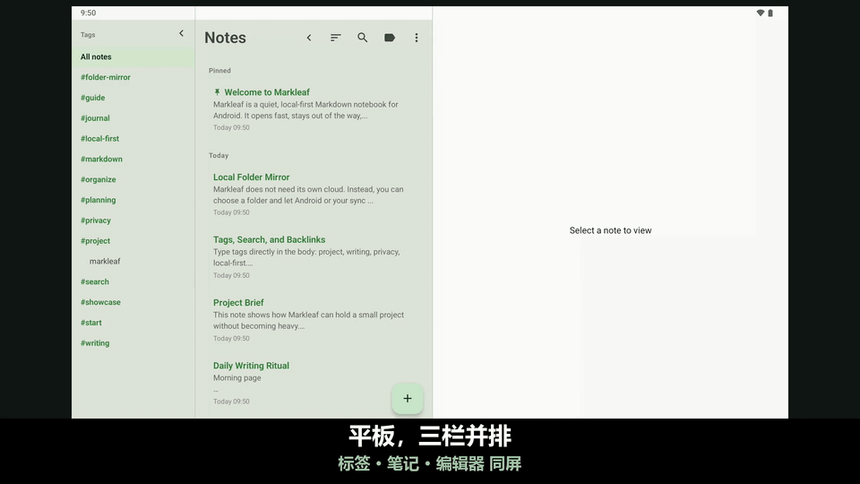

#  Markleaf

<p align="center">
  
</p>

<p align="center">
  <strong>轻轻堆叠的想法，整洁有序的 Markdown 笔记</strong><br />
  一款面向 Android 的本地优先、极简 Markdown 笔记应用
</p>

<p align="center">
  <a href="https://trendshift.io/repositories/58116?utm_source=trendshift-badge&utm_medium=badge&utm_campaign=badge-trendshift-58116"></a>
</p>

<p align="center">
  
  
  
  
  
  
</p>

<p align="center">
  <a href="README.md">English</a> ·
  <a href="README.ko.md">한국어</a> ·
  <a href="README.ja.md">日本語</a> ·
  <strong>简体中文</strong> ·
  <a href="README.de.md">Deutsch</a> ·
  <a href="README.es.md">Español</a> ·
  <a href="README.fr.md">Français</a> ·
  <a href="README.hr.md">Hrvatski</a>
</p>

<p align="center">
  <a href="https://github.com/jeiel85/markleaf-android">GitHub 仓库</a> ·
  <a href="https://github.com/jeiel85/markleaf-android/discussions">Discussions（反馈）</a> ·
  <a href="https://gitlab.com/jeiel85/markleaf-android">GitLab 镜像（存档）</a>
</p>

<p align="center">
  
</p>

<p align="center">
  <sub><code>/</code> 快速插入 → 纯 Markdown → 实时预览</sub>
</p>

<p align="center">
  
</p>

<p align="center">
  <sub>平板三栏布局 — 标签栏 · 笔记列表 · 编辑器同处一屏</sub>
</p>

---

## 🍃 Markleaf 是什么？

**Markleaf** 是一款 Android Markdown 笔记应用，它刻意剥离多余的东西，让你只专注于两件事：记录和整理。数据只保存在你的设备上，标准 Markdown 格式则保证了完整的所有权与可迁移性。就连同步也只通过 *你自己选择的文件夹* 进行 — Markleaf 本身从不联网。

[**查看品牌页面**](https://jeiel85.github.io/markleaf-android/index.zh.html) · [当前版本：v2.37.0](https://github.com/jeiel85/markleaf-android/releases/tag/v2.37.0) · [隐私政策](https://jeiel85.github.io/markleaf-android/privacy.zh.html) · [F-Droid](https://f-droid.org/packages/com.markleaf.notes/) · [Google Play](https://play.google.com/store/apps/details?id=com.markleaf.notes)

---

## ✨ 主要功能

### 书写与预览
- **`/` 快速插入** — 在行首搜索命令，即可以标准 Markdown 插入标题、列表、表格、提示块、Wiki 链接、图片等
- **实时 Markdown 预览** — 在编辑与预览之间即时切换，或开启 *显示 Markdown 语法* 选项获得实时语法着色
- **GFM 表格 / 复选框 / 引用 / 提示块（`> [!NOTE]` …）** — 全部支持预览渲染
- **代码块语法高亮** — 支持 10 种语言的着色：Kotlin、Java、Python、JavaScript/TypeScript、Bash、JSON、YAML、XML、SQL
- **脚注（`[^N]`）引用 ↔ 定义跳转** — 点击上标即可平滑滚动到定义处
- **图片附件 + 替代文本编辑** — 以独立副本保存在应用内部存储中（无需媒体权限）
- **智能 Markdown 格式切换** — 为选区或光标所在单词加上粗体 / 斜体 / 删除线 / 行内代码，再次点击可干净地移除已有标记
- **键盘快捷键** — 外接实体键盘时可用 Ctrl/Cmd+B、I、K、Shift+S 分别对应粗体、斜体、链接和删除线
- **目录（TOC）** — 在预览模式下跳转到 H1–H3 标题，方便浏览长笔记
- **衬线体 / 无衬线体切换** — 把书写区切换为衬线字体，获得书籍般的质感；代码块始终保持等宽字体
- **专注模式 / 词数、字符数与阅读时长统计 / 笔记内查找替换**

### 整理与导航
- **基于标签的分类 + 自动补全** — 只需在正文中写 `#标签` 即可自动索引，无需文件夹；输入 `#` 时会自动补全已有标签
- **Wiki 链接（`[[标题]]`）+ 反向链接面板** — 支持自动补全，一眼看清哪些笔记指向了当前这篇
- **快速切换（Ctrl+K）** — Obsidian 风格的标题子串跳转
- **SQLite FTS 全文搜索** — 快速，且能搜到正文内容
- **置顶 / 归档 / 回收站** — 永久删除前，回收站会再确认一次

### 同步与导出（No-Cloud 原则）
- **文件夹镜像同步** — 把每篇笔记以 **标题命名** 的 `.md` / `.txt` 文件镜像到你通过 SAF 选择的文件夹（Drive/Dropbox/Syncthing/OneDrive/NAS 等）；重命名笔记后文件名也会跟着变。Markleaf 自身始终离线，同步交给 *负责同步那个文件夹的外部应用*
- **打开 `.md` / `.txt` 文件阅读** — 使用 ⋮ 菜单中的 *打开文件…*，或在文件管理器中点击文件，即以渲染后的只读方式打开；在你点击 *保存为笔记* 之前不会创建任何笔记（保存时若没有标题则用文件名作为标题）。从其他应用分享过来的文件仍会立即导入。同步进来的笔记中的标签会被立即识别
- **将单篇 / 全部笔记导出为 `.md`**
- **通过系统分享面板发送**

### 设计与无障碍
- **Markleaf 绿主题 + Material You 切换** — 可选跟随 Android 12 及以上的系统壁纸配色
- **自动深色模式** — 跟随系统设置
- **平板三栏布局** — 标签侧栏 · 笔记列表 · 编辑器；点击侧栏中的标签即可就地筛选笔记列表（笔记列表仍可折叠）
- **8 种语言界面** — 韩语 / 英语 / 西班牙语 / 日语 / 法语 / 德语 / 简体中文 / 克罗地亚语资源
- **屏蔽截屏 / 最近任务预览选项** — 面向敏感笔记

---

## 🔗 可以直接用你已有的 Markdown 文件夹

Markleaf 没有自己的知识库格式。把它指向某个文件夹 — 包括 Obsidian、Logseq 或你的文本编辑器已经在打开的那个 — 它就直接在里面已有的文件上工作。

- **纯文件，本来就属于你。** 一篇笔记就是一个 `.md`（或 `.txt`）文件。把已有文件放进该文件夹，Markleaf 下次回到前台时就会把它们识别为笔记 — 不需要导入步骤。
- **你的 frontmatter 不会被破坏。** Markleaf 会添加一小段 YAML 头（`markleaf_id`、时间戳、置顶/归档状态），以便在多台设备间把文件与笔记对应起来，而 **它不认识的内容都会逐字节原样写回** — 包括 Obsidian 用来写标签的缩进块列表、嵌套映射、注释和引号写法。它添加的这段头是 Obsidian、GitHub 和 VS Code 都能解析的严格 YAML 子集。
- **还是你已经在写的那套语法。** 带反向链接面板的 `[[Wiki 链接]]`、正文内联 `#标签`、GFM 表格与复选框、`> [!NOTE]` 提示块，以及 Obsidian 风格的 `Ctrl+K` 快速切换。
- **自动对账，且足够谨慎。** 在别处所做的修改会在 Markleaf 回到前台时拉取进来（限流为每分钟一次）。即使其他编辑器完全没有碰 Markleaf 的 frontmatter，它的改动也能被发现 — 对账比较的是正文，而不只是时间戳。只有文件确实更新时它才会胜出；如果两边都改过，远端会作为一篇 *独立* 的笔记出现，而不会覆盖你的编辑，并且任何内容都不会被自动删除。

> [!IMPORTANT]
> **把 Markleaf 指向真实知识库之前，有两件事需要知道。**
> - **只读一层文件夹，不含子目录。** Markleaf 只读取你所选文件夹下的直接文件，不会递归进入子目录。用嵌套文件夹组织的知识库，Markleaf 只会在最顶层与它相遇 — 这是刻意的设计，Markleaf 用标签而不是文件夹来整理。
> - **编辑笔记会重命名它的文件。** 镜像文件名会跟随笔记标题，因此文件名与标题不一致的文件，在你于 Markleaf 中第一次保存时就会被重命名。如果你知识库中的 `[[链接]]` 指向的是旧文件名，这些链接会失效。
>
> 如果你的知识库层级很深或链接很密集，请把 Markleaf 指向一个 *单独的* 文件夹，把它当作可以后续合并的移动端收件箱，而不是知识库上的第二个编辑器。

---

## 🛠 技术栈

Markleaf 遵循当下的 Android 开发标准，采用现代且易于维护的技术栈。

- **UI**：[Jetpack Compose](https://developer.android.com/jetpack/compose) + Material 3 + Material You 动态取色
- **架构**：简洁的分层划分（core / data / domain / feature / ui）+ Repository 模式
- **数据库**：[Room](https://developer.android.com/training/data-storage/room) — 基于 SQLite 的本地持久化，使用 FTS4 虚拟表实现全文搜索
- **Markdown 解析器**：[commonmark-java](https://github.com/commonmark/commonmark-java)（CommonMark 0.30 + GFM 扩展：表格、删除线、任务列表、脚注、YAML frontmatter）
- **异步**：[Kotlin 协程](https://kotlinlang.org/docs/coroutines-overview.html) 与 [Flow](https://kotlinlang.org/docs/flow.html)
- **Storage Access Framework（SAF）** — 文件夹镜像同步与图片附件
- **图片加载**：[Coil](https://coil-kt.github.io/coil/) — 对 F-Droid 友好的 Apache 2.0 许可
- **DataStore Preferences** — 应用设置
- **Profile Installer 1.4.0 + Macrobenchmark** — 冷启动基准配置文件测量（在 TB320FC 上为 326ms）
- **测试**：JUnit + Robolectric + [Roborazzi](https://github.com/takahirom/roborazzi) 视觉回归测试（Linux 基准图，阈值 0.005）
- **CI**：GitHub Actions — build 与 instrumented tests 为必需检查，另有 launch-smoke、record-roborazzi，以及打标签时的签名发布

---

## 🏗 架构

为了分离关注点并便于测试，Markleaf 采用如下分层结构。

```text
com.markleaf.notes
├── core          # 共享核心逻辑：Markdown 处理、附件、同步
├── data          # Room 数据库、实体、Repository 实现（数据源）
├── domain        # 模型、Repository 接口（业务逻辑）
├── feature       # 各屏幕的 UI 与 ViewModel（表现层）
│   ├── editor    # 编辑器、查找/替换、Wiki 链接补全、提示块、表格
│   ├── notes     # 笔记列表、快速切换、归档
│   ├── search    # FTS 全文搜索
│   ├── tags      # 标签索引
│   ├── trash     # 回收站 / 永久删除
│   └── settings  # 主题、同步文件夹、屏蔽截屏等
├── navigation    # Jetpack Compose Navigation 配置
└── ui            # 主题（Markleaf 绿 / Material You）、共享组件
```

---

## 🚀 开始使用

### 安装

> [!NOTE]
> **Google Play 更新目前处于暂停状态。** 在个人开发者的韩国营业执照政策要求解决之前，新版本不会推送到 Play 商店。要获取当前版本，请使用 **GitHub Releases**。当 F-Droid 的构建跟上后，它仍是推荐的更新渠道。（如果你已从 Play 商店安装，应用会继续正常使用。）

- **F-Droid** *（推荐，可自动更新）*：[F-Droid 上的 Markleaf](https://f-droid.org/packages/com.markleaf.notes/) — 在 F-Droid 客户端中搜索，或通过上面的链接安装。它的目录可能晚于 GitHub 发布；如果暂时还没有显示当前版本，请使用下面的 GitHub Releases。它使用相同的签名密钥（SHA-256 `0be97352…f91a`），因此即使你先侧载了 GitHub 的 APK，后续更新也能无缝衔接。
- **直接安装 APK**：从 [GitHub v2.37.0 发布页](https://github.com/jeiel85/markleaf-android/releases/tag/v2.37.0) 下载 APK，然后在你的 Android 设备上运行。
- **Google Play**：[Google Play 上的 Markleaf](https://play.google.com/store/apps/details?id=com.markleaf.notes) — **更新已暂停**（见上方说明）。如果你已经安装，它会继续可用；当前版本请用 GitHub Releases，或等 F-Droid 上架后使用 F-Droid。

### 从源码构建
如果你想构建或参与贡献，请按以下步骤操作。

```bash
# 克隆仓库
git clone https://github.com/jeiel85/markleaf-android.git

# 进入项目目录
cd markleaf-android

# 构建并安装
./gradlew installDebug
```

Markleaf 的缺陷修复大多始于别人的一份报告。写下这些报告的人都记录在 [THANKS.md](THANKS.md) 中。

---

## 🔒 No-Cloud by design

Markleaf 自身从不访问网络。你的数据是否离开设备，*完全由你决定*。

- ✅ **没有** 声明 `android.permission.INTERNET` — Markleaf 自身不发起任何网络请求
- ✅ **没有** Markleaf 服务器 / 后端
- ✅ **没有** 分析 / 广告 / 跟踪 / 闭源 SDK
- ✅ `android:allowBackup="false"` — Markleaf 的数据被排除在 Android 自动备份 / 设备迁移之外
- ✅ 只有当 *你* 导出、分享、打开外部链接或选择 SAF 文件夹时，数据才会经由系统路径移动
- ✅ 完全开源，任何人都可依据 Apache 2.0 审查

“绝不离开你的设备”具体是如何做到的，记录在 [隐私政策](docs/PRIVACY.md) 和 [No-Cloud 认证](docs/NOCLOUD_CERTIFICATION.md) 中。

---

## 🗺 路线图

### v1.x — MVP
- [x] 基础的 Markdown 编辑与保存
- [x] 基于标签的筛选与搜索
- [x] 新的应用图标与品牌形象
- [x] 实时 Markdown 预览与深色模式
- [x] 高性能 SQLite FTS 搜索
- [x] 平板双栏布局优化
- [x] 单篇 / 全部笔记的 Markdown 导出
- [x] v1.0.0 稳定版发布

### v2.x — Bear 级别的扩展（进行中）
- [x] **v2.3** CommonMark 解析器 — 提示块、GFM 删除线、任务列表、脚注、YAML frontmatter
- [x] **v2.4–2.5** Wiki 链接（`[[标题]]`）+ 自动补全 + 反向链接面板
- [x] **v2.6** 图片附件 + 替代文本 + 灯箱
- [x] **v2.7** SAF 文件夹镜像同步（委托给 Drive/Dropbox/Syncthing，仍然不需要 INTERNET）
- [x] **v2.8** Material You 切换 + 恢复 Markleaf 绿主题
- [x] **v2.9** 屏蔽截屏选项，建立视觉回归测试（Roborazzi）
- [x] **v2.10** 代码块语法高亮（10 种语言）
- [x] **v2.11** 恢复 GFM 表格预览
- [x] **v2.12** 快速切换（Ctrl+K）
- [x] **v2.13** 笔记内查找 / 替换
- [x] **v2.14** 脚注引用 ↔ 定义的点击跳转
- [x] **v2.15** F-Droid 提交稳定化与 no-cloud 文档
- [x] **v2.16** 主屏幕小组件、生物识别锁、开源透明度、智能 Markdown 格式化
- [x] **v2.17** 支持打开 / 分享方式导入外部 `.md`/`.txt` 文件，修复文件夹同步的重复笔记与标签识别问题
- [x] **v2.18** 文件夹同步的文件以笔记标题命名（重命名会跟随）+ 可选 `.md`/`.txt`
- [x] **v2.19** 首次启动时提供六篇示例笔记 + PDF/Markdown 导出不再重复标题
- [x] **v2.20** 键盘快捷键、`#标签` 自动补全、目录、衬线字体、平板三栏（标签侧栏 + 就地筛选）布局
- [x] **v2.21** 预测式返回、更精致的过渡动画、列表/卡片动效、可折叠设备的标签栏、任务列表勾选
- [x] **v2.22** `/` 快速插入命令，支持触摸与实体键盘选择，并提供六种语言的本地化菜单
- [x] **Google Play 公开上架** — 任何人都可以从 Play 商店安装

---

## 📜 许可证

本项目基于 **Apache License 2.0** 授权。详情请参阅 `LICENSE` 文件。

---

<p align="center">
  Made with ❤️ by <strong>Markleaf Team</strong>
</p>
